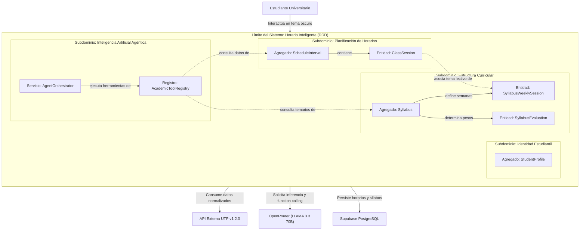
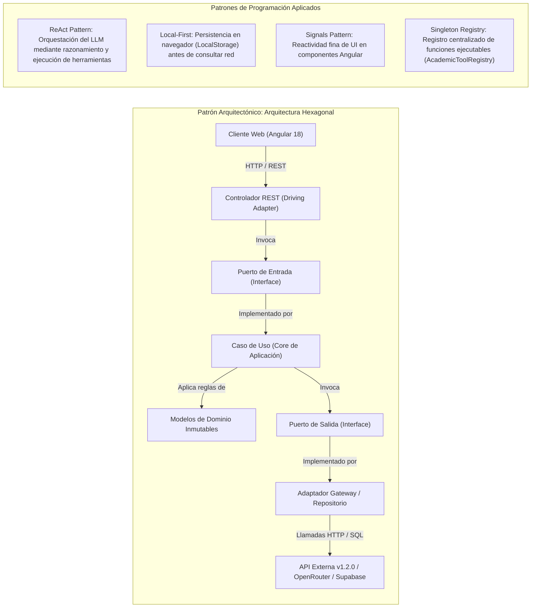
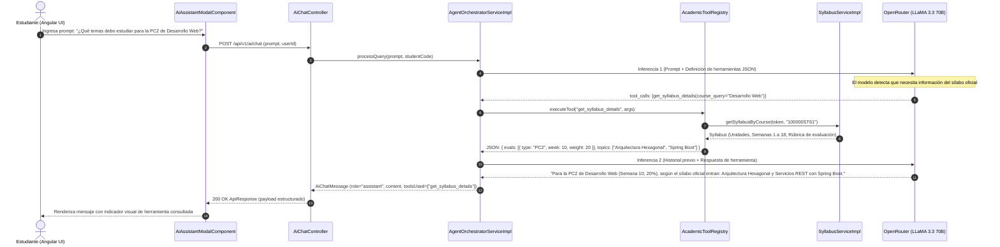
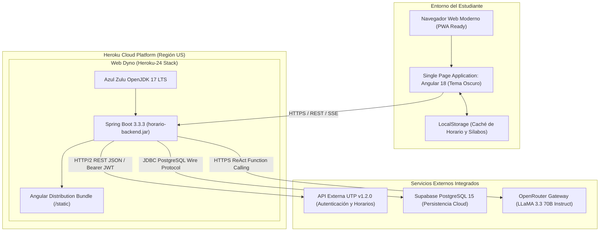
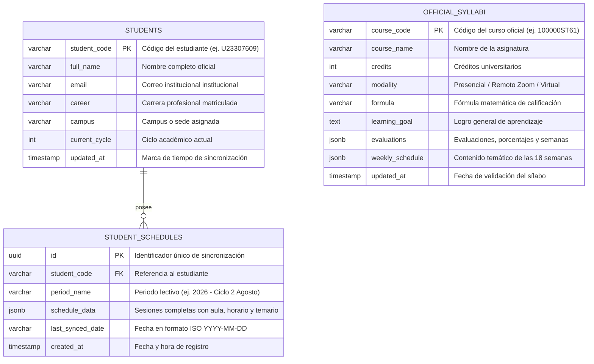
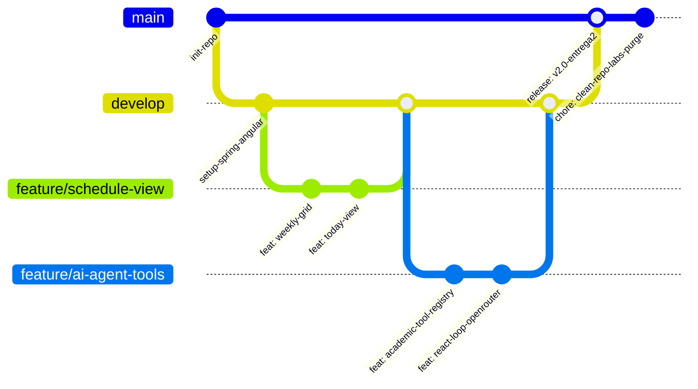

# FACULTAD DE INGENIERÍA Y SISTEMAS

## ESCUELA PROFESIONAL DE INGENIERÍA DE SISTEMAS

# Horario Inteligente: Sistema Web Académico con Integración Curricular y Asistente Agéntico

**VIII Ciclo**

**Asignatura:** Desarrollo Web Integrado / Taller de Proyectos de Sistemas  
**Docente:**  
**Sección:**

### Autores

| Apellidos y nombres | % de participación |
|---|---:|
| Laurente, Joan (Líder - Ingeniero de Inteligencia Artificial & Agentes Autónomos) | 100% |
| Integrante 2 (Arquitecto de Software & Backend Lead) | 100% |
| Integrante 3 (Desarrollador Frontend Angular - UI/UX) | 100% |
| Integrante 4 (Ingeniero de Base de Datos & Persistencia Cloud) | 100% |
| Integrante 5 (Ingeniero de Calidad QA & DevOps) | 100% |

**LIMA, PERÚ, SEPTIEMBRE 2026**

---

# TABLA DE CONTENIDOS

1. [Introducción](#1-introducción)
   - 1.1. [Descripción breve del proyecto](#11-descripción-breve-del-proyecto)
   - 1.2. [Objetivos del proyecto](#12-objetivos-del-proyecto)
   - 1.3. [Importancia y relevancia del proyecto en el contexto actual](#13-importancia-y-relevancia-del-proyecto-en-el-contexto-actual)
   - 1.4. [Lean Canvas](#14-lean-canvas)
   - 1.5. [Equipo del Proyecto](#15-equipo-del-proyecto)
   - 1.6. [Cronograma del Proyecto](#16-cronograma-del-proyecto)
   - 1.7. [Metodologías Aplicadas](#17-metodologías-aplicadas)

2. [Antecedentes](#2-antecedentes)
   - 2.1. [Estado del arte](#21-estado-del-arte)
   - 2.2. [Tecnologías o proyectos similares existentes](#22-tecnologías-o-proyectos-similares-existentes)
   - 2.3. [Justificación de por qué este proyecto es necesario o relevante](#23-justificación-de-por-qué-este-proyecto-es-necesario-o-relevante)
   - 2.4. [Bases Teóricas](#24-bases-teóricas)

3. [Descripción del Proyecto](#3-descripción-del-proyecto)
   - 3.1. [Detalles técnicos del proyecto](#31-detalles-técnicos-del-proyecto)
   - 3.2. [Funcionalidades principales](#32-funcionalidades-principales)
   - 3.3. [Tecnologías utilizadas](#33-tecnologías-utilizadas)
   - 3.4. [Diagramas o esquemas](#34-diagramas-o-esquemas)
     - 3.4.1. [Diagrama de Contexto y de Dominio (DDD)](#341-diagrama-de-contexto-y-de-dominio-ddd)
     - 3.4.2. [Diagrama de Clases](#342-diagrama-de-clases)
     - 3.4.3. [Diagrama de Paquetes](#343-diagrama-de-paquetes)
     - 3.4.4. [Diagrama de Patrones de Diseño Arquitectónico y de Programación](#344-diagrama-de-patrones-de-diseño-arquitectónico-y-de-programación)
     - 3.4.5. [Diagrama de Secuencia con escenarios de pruebas](#345-diagrama-de-secuencia-con-escenarios-de-pruebas)
     - 3.4.6. [Diagrama de Despliegue](#346-diagrama-de-despliegue)
     - 3.4.7. [Diseño de la Base de Datos](#347-diseño-de-la-base-de-datos)
     - 3.4.8. [Diccionario de Datos](#348-diccionario-de-datos)
     - 3.4.9. [Prototipos (Wireframes)](#349-prototipos-wireframes)
     - 3.4.10. [Mockups y Especificación Visual](#3410-mockups-y-especificación-visual)
   - 3.5. [Landing Page](#35-landing-page)

4. [Desarrollo](#4-desarrollo)
   - 4.1. [Proceso de desarrollo del proyecto](#41-proceso-de-desarrollo-del-proyecto)
     - 4.1.1. [Estrategia de Branching](#411-estrategia-de-branching)
     - 4.1.2. [Ciclo de desarrollo con TDD: Red-Green-Refactor](#412-ciclo-de-desarrollo-con-tdd-red-green-refactor)
     - 4.1.3. [Event Storming y Diseño de Agregados (DDD)](#413-event-storming-y-diseño-de-agregados-ddd)
   - 4.2. [Desafíos enfrentados y cómo fueron superados](#42-desafíos-enfrentados-y-cómo-fueron-superados)
   - 4.3. [Colaboradores o equipo involucrado en el desarrollo](#43-colaboradores-o-equipo-involucrado-en-el-desarrollo)

5. [Resultados](#5-resultados)
   - 5.1. [Demostración o ejemplos de cómo funciona el proyecto](#51-demostración-o-ejemplos-de-cómo-funciona-el-proyecto)
   - 5.2. [Métricas de rendimiento o éxito](#52-métricas-de-rendimiento-o-éxito)
     - 5.2.1. [Cobertura de Tests](#521-cobertura-de-tests)
     - 5.2.2. [Deuda Técnica](#522-deuda-técnica)
     - 5.2.3. [Tiempo de Respuesta](#523-tiempo-de-respuesta)
   - 5.3. [Casos de uso o ejemplos de aplicación](#53-casos-de-uso-o-ejemplos-de-aplicación)

6. [Impacto](#6-impacto)
   - 6.1. [Potenciales beneficios y aplicaciones del proyecto](#61-potenciales-beneficios-y-aplicaciones-del-proyecto)
   - 6.2. [Impacto en la sociedad, industria u otros campos relevantes](#62-impacto-en-la-sociedad-industria-u-otros-campos-relevantes)
   - 6.3. [Posibles mejoras o desarrollos futuros](#63-posibles-mejoras-o-desarrollos-futuros)

7. [Conclusiones](#7-conclusiones)
   - 7.1. [Recapitulación de los puntos principales del proyecto](#71-recapitulación-de-los-puntos-principales-del-proyecto)
   - 7.2. [Lecciones aprendidas durante el desarrollo](#72-lecciones-aprendidas-durante-el-desarrollo)
   - 7.3. [Reflexión sobre el éxito del proyecto en relación con los objetivos establecidos](#73-reflexión-sobre-el-éxito-del-proyecto-en-relación-con-los-objetivos-establecidos)

8. [Referencias Bibliográficas](#8-referencias-bibliográficas)

9. [Anexos](#9-anexos)

---

# 1. Introducción

## 1.1. Descripción breve del proyecto
**Horario Inteligente** es un sistema web académico enfocado en optimizar la gestión del tiempo y la planificación de estudio del estudiante universitario. El proyecto nace de una evaluación pragmática del flujo diario de un alumno de la Universidad Tecnológica del Perú (UTP), identificando brechas funcionales en las herramientas institucionales existentes:

1. **Modo Oscuro Nativo:** Disminución del agotamiento ocular provocado por interfaces predominantemente blancas durante horarios nocturnos de estudio.
2. **Contextualización Curricular en el Horario:** El sílabo es el documento contractual y pedagógico que rige el avance docente. La aplicación vincula directamente cada bloque del horario semanal con la unidad temática y los contenidos específicos que se impartirán en dicha sesión, eliminando la necesidad de buscar y descargar manualmente múltiples archivos PDF de sílabos a lo largo del ciclo.
3. **Cronograma Centralizado de Evaluaciones:** Visualización ordenada de las prácticas calificadas, avances de proyectos y exámenes, con sus respectivas semanas de ejecución, porcentajes de ponderación y el temario oficial a evaluar.
4. **Asistencia Académica con IA Agéntica:** Incorporación de un modelo de lenguaje que opera bajo el protocolo de ejecución de herramientas (*Function Calling*), consultando directamente endpoints institucionales para responder dudas puntuales de horarios, docentes y sílabos con datos fidedignos y sin alucinaciones.

Para esta segunda entrega académica, el sistema se enfoca estrictamente en estos módulos esenciales: **Horario Semanal**, **Vista Diaria (Hoy)**, **Cursos y Sílabos Normalizados**, y el **Copiloto Académico Agéntico**.

---

## 1.2. Objetivos del proyecto

### 1.2.1. Objetivo General
Diseñar e implementar una solución web académica basada en Arquitectura Hexagonal con Spring Boot 3 y Angular 18 Standalone, que unifique el horario de clases con el avance temático del sílabo oficial, ofrezca ergonomía visual mediante un tema oscuro de alto contraste y provea asistencia inteligente basada en agentes autónomos conectados a datos institucionales.

### 1.2.2. Objetivos Específicos
1. **Ergonomía Visual:** Proveer una interfaz con fondo oscuro (`#070709`) que cumpla con los estándares de contraste WCAG AA, mitigando la fatiga ocular en jornadas prolongadas.
2. **Integración Curricular Automática:** Asignar a cada bloque horario el tema correspondiente a la semana y sesión lectiva, consumiendo el catálogo de sílabos normalizados.
3. **Planificación de Exámenes:** Ofrecer una vista cronológica de evaluaciones con detalle de fórmulas de cálculo, ponderaciones porcentuales y temas requeridos.
4. **Asistencia Agéntica Determinista:** Integrar un agente conversacional basado en LLaMA 3.3 70B que utilice *Function Calling* sobre un registro de herramientas académicas (`AcademicToolRegistry`), garantizando anclaje de datos (*grounding*).
5. **Rendimiento Operativo:** Reducir los tiempos de carga en consultas frecuentes a menos de 50 ms mediante almacenamiento y caché local particionado por estudiante (*Local-First*).

---

## 1.3. Importancia y relevancia del proyecto en el contexto actual
En el contexto universitario actual, los estudiantes enfrentan una alta carga de información distribuida en plataformas disjuntas. Las deficiencias clave identificadas en el uso diario de la plataforma universitaria oficial son:

* **Incompatibilidad ergonómica:** La plataforma institucional carece de tema oscuro. Estudiantes que laboran y estudian en turnos vespertinos/nocturnos están forzados a consultar fondos blancos brillantes en dispositivos móviles o monitores.
* **Desarticulación entre calendario y contenido:** El horario tradicional solo indica el código de curso, el aula física y el horario. Al ignorar el temario del sílabo en la vista de clases, el alumno debe abrir el portal de cursos, localizar el PDF de 10 a 15 páginas y buscar la fila correspondiente a la semana actual.
* **Carencia de herramientas agénticas contextuales:** Las consultas operativas del estudiante (*"¿Qué aula me toca hoy?", "¿Qué temas entran en la PC1 de Base de Datos?", "¿Cuánto vale el examen final?"*) requieren navegar entre varias pantallas, pudiendo resolverse de forma instantánea mediante un agente con acceso a datos estructurados.
* **Fragmentación de evaluaciones:** El sistema oficial muestra las notas pasadas, pero no unifica un cronograma preventivo que muestre qué temas del sílabo se evaluarán en cada fecha programada.

Horario Inteligente aborda estas problemáticas mediante un diseño técnico enfocado exclusivamente en resolver las fricciones reales del estudiante.

---

## 1.4. Lean Canvas

| Componente | Detalle Técnico / Operativo |
| :--- | :--- |
| **1. Problema** | • Fatiga visual por ausencia de tema oscuro en la app oficial.<br>• Desconexión entre el horario semanal y los temas lectivos estipulados en el sílabo rector.<br>• Inexistencia de un asistente de IA capaz de consultar datos académicos del alumno.<br>• Falta de un calendario unificado de evaluaciones vinculado al temario de examen. |
| **2. Segmento de Clientes** | • Estudiantes universitarios de pregrado y posgrado (UTP).<br>• Alumnos que estudian en jornada nocturna o que combinan empleo y formación académica.<br>• Delegados de aula y círculos de estudio que planifican entregas de proyectos. |
| **3. Propuesta de Valor** | Plataforma académica unificada con visualización de horario en tema oscuro, integración directa de temas del sílabo en cada bloque de clase, calendario de evaluaciones ponderadas y copiloto agéntico para consultas contextuales. |
| **4. Solución** | • Interfaz web en tema oscuro nativo (`#070709`) con micro-interacciones funcionales.<br>• Ficha de clase con aula, pabellón, docente y tema correspondiente según semana lectiva.<br>• Desglose curricular por curso: unidades, semanas, fórmulas oficiales y rúbricas.<br>• Motor agéntico con *Function Calling* sobre la API académica institucional. |
| **5. Canales** | • Aplicación web responsiva (PWA) accesible desde cualquier navegador moderno.<br>• Repositorio institucional y despliegue cloud en Heroku Platform. |
| **6. Estructura de Costos** | • Cómputo e inferencia del modelo LLM (vía OpenRouter API).<br>• Infraestructura de alojamiento en Heroku Dynos (Java 17 runtime).<br>• Almacenamiento PostgreSQL serverless en Supabase DB. |
| **7. Flujos de Ingresos** | • Acceso académico abierto para la comunidad estudiantil.<br>• Esquema institucional de cuota diaria de inferencia para balancear recursos de IA. |
| **8. Métricas Clave** | • Tiempo de renderizado de la grilla horaria (< 50 ms en local).<br>• Tasa de exactitud en llamadas a herramientas del agente (> 98%).<br>• Frecuencia de consulta diaria de temarios y aulas por estudiante activo. |
| **9. Ventaja Diferencial** | Normalización de sílabos rectores y vinculación algorítmica con las sesiones del horario oficial mediante una arquitectura modular desacoplada. |

---

## 1.5. Equipo del Proyecto

El equipo de trabajo está compuesto por 5 estudiantes de Ingeniería de Sistemas con asignación técnica de responsabilidades:

1. **Ingeniero de Inteligencia Artificial & Agentes Autónomos (Joan Laurente - Responsable del Módulo de IA):**
   * Diseño de la arquitectura del agente conversacional bajo el patrón ReAct (*Reasoning + Acting*).
   * Implementación del registro de herramientas (`AcademicToolRegistry`) y definición de esquemas JSON para *Function Calling*.
   * Integración del cliente OpenRouter para el modelo LLaMA 3.3 70B y anclaje de datos (*grounding*) para evitar alucinaciones.
   * Gestión de streaming de respuestas vía Server-Sent Events (SSE).

2. **Arquitecto de Software & Backend Lead:**
   * Estructuración de la Arquitectura Hexagonal (Puertos y Adaptadores) en Spring Boot 3.3.
   * Aislamiento del dominio académico y diseño de los contratos REST de la API Externa v1.2.0.
   * Implementación de filtros de seguridad, resolución de identidad de estudiantes y configuración de CORS.

3. **Desarrollador Frontend Angular (UI/UX):**
   * Desarrollo de la interfaz cliente basada en Angular 18/19 Standalone Components y Signals.
   * Implementación del sistema de diseño en Tema Oscuro con Tailwind CSS y contraste ergonómico.
   * Construcción de la grilla semanal responsive, la vista diaria (*Today View*) y modales de clase.

4. **Ingeniero de Base de Datos & Persistencia Cloud:**
   * Modelado de datos relacional y gestión de esquemas en Supabase PostgreSQL.
   * Implementación del esquema de contingencia y persistencia en cliente (*LocalStorage*).
   * Mapeo de entidades JPA en backend para estudiantes, horarios y sílabos oficiales.

5. **Ingeniero de Calidad (QA) & DevOps:**
   * Configuración de la compilación e integración continua en Heroku con Azul Zulu OpenJDK 17.
   * Elaboración de pruebas unitarias y de integración sobre parsers y servicios de negocio.
   * Monitoreo de tiempos de respuesta y estabilidad de endpoints REST.

---

## 1.6. Cronograma del Proyecto

```mermaid
gantt
    title Cronograma de Implementación - Horario Inteligente
    dateFormat  YYYY-MM-DD
    section Fase 1: Análisis y Arquitectura
    Análisis de la plataforma oficial y requerimientos :done, a1, 2026-08-15, 2026-08-25
    Diseño de Arquitectura Hexagonal y Contratos API  :done, a2, 2026-08-26, 2026-09-05
    section Fase 2: Backend y Servicios Core
    Implementación de Casos de Uso (Horario y Sílabo)  :done, b1, 2026-09-06, 2026-09-15
    Integración de API Externa v1.2.0 y Persistencia  :done, b2, 2026-09-12, 2026-09-20
    section Fase 3: Copiloto IA y Servidor MCP
    Definición de AcademicToolRegistry (Function Calling) :done, c1, 2026-09-18, 2026-09-24
    Orquestación ReAct con LLaMA 3.3 70B vía OpenRouter   :done, c2, 2026-09-22, 2026-09-28
    section Fase 4: Frontend y Experiencia Visual
    Maquetación de Tema Oscuro en Angular Standalone   :done, d1, 2026-09-15, 2026-09-22
    Integración de Vistas: Hoy, Semanal y Sílabos      :done, d2, 2026-09-23, 2026-09-28
    section Fase 5: Entrega 2 y Validación
    Auditoría de Repositorio y Pruebas Técnicas        :active, e1, 2026-09-28, 2026-10-02
    Sustentación de Segunda Entrega Académica           :crit, e2, 2026-10-03, 2026-10-05
```

---

## 1.7. Metodologías Aplicadas
* **Scrum Ágil Adaptado:** Ciclos iterativos de dos semanas orientados a entregables funcionales (sprints), priorizando primero la estabilidad de datos de horarios y luego la asistencia inteligente.
* **Domain-Driven Design (DDD):** Delimitación clara del dominio académico mediante conceptos rectores: `ClassSession`, `Syllabus`, `StudentProfile` y `AcademicTool`.
* **Desarrollo Guiado por Pruebas (TDD Pragmático):** Validación previa de componentes algorítmicos complejos, como el cálculo de ponderaciones porcentuales y el mapeo de semanas lectivas.
* **Arquitectura Hexagonal (Ports & Adapters):** Desacoplamiento total entre las reglas de negocio y los mecanismos de entrada (controladores REST) o salida (adaptadores HTTP a servicios universitarios y bases de datos).

---

# 2. Antecedentes

## 2.1. Estado del arte
Los sistemas de información académica universitarios a nivel global (como Blackboard Learn, Canvas LMS y Ellucian Banner) se centran primordialmente en la gestión de calificaciones, foros y carga de archivos, relegando la visualización del horario a calendarios estáticos o vistas en formato de lista. En el ámbito de aplicaciones móviles de consumo estudiantil, herramientas como Class Timetable o Notion Templates ofrecen interfaces de usuario atractivas pero exigen que el alumno ingrese manualmente cada asignatura, aula y tema de clase semana a semana. 

En paralelo, la adopción de Modelos de Lenguaje Grande (LLMs) en educación ha transitado desde chatbots de propósito general sin conexión a datos (*RAG básico*) hacia arquitecturas agénticas deterministas (*Tool-Augmented LLMs*), donde el modelo no genera respuestas probabilísticas sobre información fáctica, sino que ejecuta funciones estructuradas sobre APIs institucionales validadas.

---

## 2.2. Tecnologías o proyectos similares existentes

| Sistema Evaluado | Ventajas Identificadas | Limitaciones Observadas |
| :--- | :--- | :--- |
| **App UTP Oficial** | • Acceso nativo con SSO institucional.<br>• Notificaciones oficiales del portal. | • Ausencia total de tema oscuro (solo fondo blanco).<br>• El horario no indica qué tema se impartirá en clase.<br>• Sílabos fragmentados en documentos PDF externos.<br>• Sin asistencia de IA para resolver consultas rápidas. |
| **Google Calendar / Outlook** | • Sincronización multiplataforma.<br>• Gestión de alertas y recordatorios. | • Requiere importación y configuración manual continua.<br>• Desconectado de la estructura pedagógica de los sílabos. |
| **Class Timetable** | • Interfaz visual clara y sencilla. | • Totalmente manual; no se conecta a bases de datos universitarias. |
| **Horario Inteligente (Proyecto)** | • Tema oscuro ergonómico por defecto.<br>• Temas del sílabo oficial visibles en cada bloque horario.<br>• Calendario unificado de exámenes y ponderaciones.<br>• Asistente IA con ejecución de herramientas institucionales. | • Requiere conexión a la API externa para la sincronización inicial del ciclo. |

---

## 2.3. Justificación de por qué este proyecto es necesario o relevante
El proyecto se justifica desde tres perspectivas concretas:
1. **Salud y Ergonomía del Alumno:** Gran parte de los estudiantes revisan sus asignaciones en horarios nocturnos o antes de descansar. Un sistema con fondo blanco brillante somete al usuario a fotofobia y fatiga muscular ocular. El modo oscuro técnico de alto contraste reduce significativamente este impacto.
2. **Efectividad en el Aprendizaje:** Al conocer de antemano el tema exacto que dictará el profesor en la sesión de hoy, el estudiante puede realizar lecturas previas orientadas al sílabo, transformando una clase pasiva en una sesión participativa.
3. **Optimización del Acceso a la Información:** Centralizar el aula física, el enlace a la sala remota, la unidad de aprendizaje y la fecha del siguiente examen en una única pantalla elimina la fricción de navegación que actualmente experimentan los alumnos en las aplicaciones institucionales.

---

## 2.4. Bases Teóricas
* **Arquitectura Hexagonal (Cockburn, 2005):** Permite aislar el núcleo del negocio académico de los detalles de infraestructura mediante interfaces (*Ports*) e implementaciones concretas (*Adapters*). Esto permite sustituir el proveedor de inferencia de IA o el motor de base de datos sin alterar la lógica de cálculo del horario.
* **Domain-Driven Design (Evans, 2004):** Establece el modelado a partir de agregados coherentes e invariantes del negocio, como la consistencia de que la sumatoria de evaluaciones de un sílabo debe equivaler al 100%.
* **Patrón ReAct: Reasoning + Acting (Yao et al., 2022):** Paradigma que combina cadenas de pensamiento (*Reasoning*) con la ejecución de acciones en el entorno (*Acting*). Permite al asistente de IA determinar cuándo requiere consultar el horario antes de emitir una respuesta.
* **Arquitectura Local-First (Kleppmann et al., 2019):** Otorga prioridad a la copia de datos en el cliente (almacenamiento local estructurado), asegurando que el estudiante acceda a su horario aun en condiciones de conectividad inestable.

---

# 3. Descripción del Proyecto

## 3.1. Detalles técnicos del proyecto

### 3.1.1. Atributos de Calidad
* **Rendimiento:** Carga inicial de datos desde almacenamiento local en menos de 50 ms. Consultas a la API Externa completadas en menos de 350 ms en condiciones normales de red.
* **Confiabilidad:** Respuestas del asistente de IA ancladas estrictamente a los resultados de las herramientas (*grounding*), eliminando alucinaciones sobre aulas o fechas inexistentes.
* **Usabilidad:** Diseño oscuro nativo con relación de contraste mínima de 7:1 para texto principal (`#FFFFFF` sobre `#070709`), superando el criterio de éxito WCAG 2.1 Nivel AAA.
* **Mantenibilidad:** Separación estricta de responsabilidades entre el frontend (Angular) y la lógica de integración (Spring Boot Hexagonal).

### 3.1.2. Restricciones Técnicas
* **Tiempo de Ejecución:** Java 17 LTS (Azul Zulu) en el backend y Node.js 18+ para compilación de Angular.
* **Límites de Recursos Cloud:** Despliegue en contenedor con límite de memoria de 512 MB de RAM (Heroku Standard Dyno).
* **Consumo de Cuota de IA:** Limitación diaria de consultas de inferencia por código de estudiante para evitar saturación de presupuesto en la pasarela LLM.

### 3.1.3. Interfaces Externas
* **API Externa Institucional v1.2.0:** Endpoints REST que proveen datos autenticados de estudiantes, horarios estructurados y sílabos en formato JSON y Markdown.
* **OpenRouter API:** Pasarela HTTPS hacia el modelo `meta-llama/llama-3.3-70b-instruct` con soporte nativo de *Function Calling*.
* **Supabase PostgreSQL:** Base de datos cloud accesible vía JDBC y REST para persistencia y respaldo de perfiles y horarios.

### 3.1.4. Interfaces de Usuario
* **Pantalla de Acceso (Login):** Formulario ergonómico con autenticación institucional y enlace a políticas de privacidad.
* **Vista Diaria (Today View):** Ficha superior con la clase en curso o la próxima sesión, indicando tiempo restante, aula física, docente y tema del sílabo.
* **Horario Semanal (Weekly View):** Matriz interactiva de lunes a sábado con filtrado dinámico por semana lectiva (1 a 18).
* **Catálogo de Sílabos (Courses View):** Acordeón por asignatura con desglose de unidades, semanas de clase, fórmulas de calificación y rúbricas.
* **Copiloto IA (Modal):** Panel conversacional con visualización de herramientas ejecutadas en tiempo real.

### 3.1.5. Control de Errores
* **Backend:** Manejador global `GlobalExceptionHandler` con `@RestControllerAdvice` que captura excepciones del dominio (`EntityNotFoundException`, `ExternalApiException`) y devuelve el sobre estándar `ApiResponse<T>` con código HTTP coherente.
* **Frontend:** Servicio centralizado `UiFeedbackService` que muestra notificaciones contextuales tipo Toast y activa mecanismos de contingencia cuando la red no está disponible.

---

## 3.2. Funcionalidades principales
1. **Autenticación Institucional Segura:** Validación contra el proveedor de identidad institucional y almacenamiento de sesión mediante tokens efímeros Bearer en el cliente.
2. **Visualización de Clase Actual y Siguiente:** Algoritmo temporal que compara la hora del sistema contra los bloques de clase del día, destacando la sesión inmediata.
3. **Mapeo Temático de Sesión:** Inyección directa del contenido lectivo según la semana actual del calendario académico y el sílabo rector.
4. **Calculadora y Fórmulas de Evaluación:** Presentación de la ponderación porcentual de cada práctica, laboratorio y examen, evitando discrepancias en el cálculo de notas.
5. **Copiloto Agéntico con Herramientas Académicas:** Capacidad de responder preguntas como: *"¿A qué hora empieza mi clase de Redes?", "¿Dónde queda el aula A0402?", "¿Qué entra en la PC2 según el sílabo?"*.

---

## 3.3. Tecnologías utilizadas

### 3.3.1. Back End
* **Java 17 LTS:** Lenguaje principal de backend orientado a objetos y programación funcional.
* **Spring Boot 3.3.3:** Framework de desarrollo ágil de servicios empresariales.
* **Spring Web MVC:** Controladores REST para la exposición de endpoints HTTP.
* **Spring Data JPA & Hibernate:** Capa de persistencia para mapeo relacional.
* **H2 Database Engine:** Base de datos en memoria para entornos de prueba y ejecución local.

### 3.3.2. Frontend
* **Angular 18 / 19:** Framework web frontend con arquitectura Standalone Components y Signals.
* **TypeScript 5.5:** Tipado estático estricto que modela los contratos de la API v1.2.0.
* **Tailwind CSS 3.4:** Motor de estilos utility-first optimizado para la paleta en tema oscuro.
* **Lucide Angular:** Conjunto de iconos vectoriales ligeros de alta legibilidad.

### 3.3.3. Base de Datos
* **PostgreSQL 15 (Supabase Cloud):** Motor relacional principal para persistencia de perfiles y cachés de horarios.
* **LocalStorage Web API:** Almacenamiento estructurado en el navegador para garantizar navegación Local-First sin latencia de red.

### 3.3.4. Testing
* **JUnit 5 & Mockito:** Pruebas unitarias sobre casos de uso y adaptadores en el backend.
* **AssertJ:** Aserciones fluidas para validación de estructuras de datos curriculares.

### 3.3.5. DevOps & Despliegue
* **Git & GitHub:** Control de versiones del código fuente.
* **Heroku Cloud Platform (Heroku-24 Stack):** Plataforma como servicio (PaaS) que ejecuta el empaquetado JAR ejecutable con Azul Zulu OpenJDK 17.
* **Maven Wrapper (`mvnw`):** Gestión determinista de dependencias de construcción.

---

## 3.4. Diagramas o esquemas

### 3.4.1. Diagrama de Contexto y de Dominio (DDD)



---

### 3.4.2. Diagrama de Clases

```mermaid
classDiagram
    class ScheduleController {
        -ScheduleServicePort scheduleService
        +getSchedule(authHeader) ResponseEntity
    }

    class SyllabusController {
        -SyllabusServicePort syllabusService
        +getSyllabus(courseCode, authHeader) ResponseEntity
    }

    class AiChatController {
        -AiAssistantServicePort aiService
        +chat(request, authHeader) ResponseEntity
    }

    class ScheduleServicePort {
        <<interface>>
        +getStudentSchedule(token, studentCode) ScheduleInterval
    }

    class SyllabusServicePort {
        <<interface>>
        +getSyllabusByCourse(token, courseCode) Syllabus
    }

    class AiAssistantServicePort {
        <<interface>>
        +processQuery(prompt, studentCode, token) AiChatMessage
    }

    class ScheduleServiceImpl {
        -UtpPortalGatewayPort gatewayPort
        -ScheduleRepositoryPort repositoryPort
        +getStudentSchedule(token, studentCode) ScheduleInterval
    }

    class SyllabusServiceImpl {
        -UtpPortalGatewayPort gatewayPort
        -SyllabusRepositoryPort repositoryPort
        +getSyllabusByCourse(token, courseCode) Syllabus
    }

    class AgentOrchestratorServiceImpl {
        -AcademicToolRegistry toolRegistry
        -LlmGatewayPort llmGateway
        +processQuery(prompt, studentCode, token) AiChatMessage
        -runReActLoop(prompt, studentCode) String
    }

    class AcademicToolRegistry {
        -ScheduleServicePort scheduleService
        -SyllabusServicePort syllabusService
        +executeTool(toolName, argumentsJson) String
        +getAvailableToolsSchema() List
    }

    ScheduleController --> ScheduleServicePort
    SyllabusController --> SyllabusServicePort
    AiChatController --> AiAssistantServicePort

    ScheduleServiceImpl ..|> ScheduleServicePort
    SyllabusServiceImpl ..|> SyllabusServicePort
    AgentOrchestratorServiceImpl ..|> AiAssistantServicePort

    AgentOrchestratorServiceImpl --> AcademicToolRegistry
    AcademicToolRegistry --> ScheduleServicePort
    AcademicToolRegistry --> SyllabusServicePort
```



---

### 3.4.3. Diagrama de Paquetes

```mermaid
graph TD
    subgraph PresentationLayer["com.utp.horario.presentation"]
        Controllers["Controllers: Auth, Schedule, Syllabus, AiChat"]
        DTOs["DTOs: ApiResponse, AiChatRequest, AuthRequest"]
        Exceptions["GlobalExceptionHandler"]
    end

    subgraph ApplicationLayer["com.utp.horario.application"]
        UseCases["Use Cases: ScheduleServiceImpl, SyllabusServiceImpl, AgentOrchestratorServiceImpl"]
        Tools["Tool Registry: AcademicToolRegistry, AcademicToolService"]
    end

    subgraph DomainLayer["com.utp.horario.domain"]
        Models["Models: ClassSession, Course, Syllabus, StudentProfile, AiChatMessage"]
        PortsIn["Ports In: ScheduleServicePort, SyllabusServicePort, AiAssistantServicePort"]
        PortsOut["Ports Out: UtpPortalGatewayPort, LlmGatewayPort, ScheduleRepositoryPort"]
    end

    subgraph InfrastructureLayer["com.utp.horario.infrastructure"]
        AdaptersExternal["External: UtpPortalGatewayAdapter, OpenRouterGatewayAdapter"]
        AdaptersPersistence["Persistence: ScheduleRepositoryAdapter, SyllabusRepositoryAdapter"]
        Security["Security: SecurityConfig, CurrentStudentArgumentResolver"]
    end

    PresentationLayer --> PortsIn
    PresentationLayer --> DTOs
    ApplicationLayer ..|> PortsIn
    ApplicationLayer --> PortsOut
    ApplicationLayer --> Models
    InfrastructureLayer ..|> PortsOut
    InfrastructureLayer --> Models
```

---

### 3.4.4. Diagrama de Patrones de Diseño Arquitectónico y de Programación



---

### 3.4.5. Diagrama de Secuencia con escenarios de pruebas



---

### 3.4.6. Diagrama de Despliegue



---

### 3.4.7. Diseño de la Base de Datos

El diseño de persistencia para esta segunda entrega omite deliberadamente los módulos no esenciales (Marketplace, Red Social y Comunidad) para centrarse exclusivamente en las entidades de autenticación, horarios y sílabos oficiales:



---

### 3.4.8. Diccionario de Datos

#### Tabla: `students`
Almacena el perfil básico del estudiante autenticado mediante el SSO institucional.
| Campo | Tipo | Nulo | Clave | Descripción |
| :--- | :--- | :---: | :---: | :--- |
| `student_code` | `VARCHAR(20)` | NO | **PK** | Código único de alumno (ej. `U23307609`). |
| `full_name` | `VARCHAR(150)` | NO | - | Nombre y apellidos oficiales del estudiante. |
| `email` | `VARCHAR(100)` | NO | - | Correo electrónico institucional (`@utp.edu.pe`). |
| `career` | `VARCHAR(120)` | SÍ | - | Carrera profesional de matrícula vigente. |
| `campus` | `VARCHAR(80)` | SÍ | - | Sede o campus universitario asignado. |
| `current_cycle` | `INTEGER` | SÍ | - | Ciclo cursado actualmente (1 al 10). |
| `updated_at` | `TIMESTAMPTZ` | NO | - | Timestamp de la última sincronización de perfil. |

#### Tabla: `official_syllabi`
Repositorio normalizado de sílabos rectores oficiales para enriquecer el horario y alimentar al asistente IA.
| Campo | Tipo | Nulo | Clave | Descripción |
| :--- | :--- | :---: | :---: | :--- |
| `course_code` | `VARCHAR(30)` | NO | **PK** | Código oficial de asignatura (ej. `100000ST61`). |
| `course_name` | `VARCHAR(150)` | NO | - | Denominación oficial del curso. |
| `credits` | `INTEGER` | NO | - | Número de créditos académicos del curso. |
| `modality` | `VARCHAR(30)` | NO | - | Modalidad de dictado: `Presencial`, `Remoto Zoom`, `Virtual`. |
| `formula` | `VARCHAR(255)` | NO | - | Expresión matemática oficial de calificación del curso. |
| `learning_goal` | `TEXT` | SÍ | - | Descripción del logro general de aprendizaje de la materia. |
| `evaluations` | `JSONB` | NO | - | Arreglo JSON con tipo de evaluación, semana y porcentaje oficial. |
| `weekly_schedule` | `JSONB` | NO | - | Detalle estructurado de unidades, temas y logros por semana. |
| `updated_at` | `TIMESTAMPTZ` | NO | - | Timestamp de validación e inserción en el sistema. |

#### Tabla: `student_schedules`
Almacenamiento del horario estructurado asociado a cada alumno para contingencia sin conexión.
| Campo | Tipo | Nulo | Clave | Descripción |
| :--- | :--- | :---: | :---: | :--- |
| `id` | `UUID` | NO | **PK** | Identificador UUID del registro de horario. |
| `student_code` | `VARCHAR(20)` | NO | **FK** | Código de estudiante relacionado. |
| `period_name` | `VARCHAR(50)` | NO | - | Periodo académico oficial (ej. `2026 - Ciclo 2 Agosto`). |
| `schedule_data` | `JSONB` | NO | - | Estructura completa de eventos con aula, docente y tema de clase. |
| `last_synced_date` | `VARCHAR(10)` | NO | - | Fecha de sincronización en formato `YYYY-MM-DD`. |
| `created_at` | `TIMESTAMPTZ` | NO | - | Fecha y hora de creación del registro. |

---

### 3.4.9. Prototipos (Wireframes)

#### Prototipo 1: Vista Diaria ("Hoy") con Temario de Sílabo en Vivo
```text
+------------------------------------------------------------------------------------+
| [HORARIO.UTP]                      [Hoy]   [Horario Semanal]   [Cursos]  [Copiloto] |
| Tema: Oscuro Activo                                          Estudiante: U23307609 |
+------------------------------------------------------------------------------------+
|  LUNES, 29 DE SEPTIEMBRE • SEMANA 8 (CICLO REGULAR)                                |
|                                                                                    |
|  +------------------------------------------------------------------------------+  |
|  | [CLASE EN CURSO] • Termina a las 20:30 (Faltan 45 min)                        |  |
|  | DESARROLLO WEB INTEGRADO (Sección 34374)                    [UNIRSE A ZOOM]  |  |
|  | Docente: Ivan Robles Fernandez   |   Pabellón: A   |   Aula: A0402 (Piso 4)   |  |
|  |                                                                              |  |
|  | >> TEMA DE LA SESIÓN SEGÚN SÍLABO OFICIAL:                                   |  |
|  |    "Arquitectura Hexagonal: Implementación de Puertos y Adaptadores en Java" |  |
|  |    Unidad 2: Construcción de Servicios Web Empresariales                     |  |
|  +------------------------------------------------------------------------------+  |
|                                                                                    |
|  CALENDARIO DE PRÓXIMAS EVALUACIONES (Temas según Sílabo):                         |
|  +------------------------------------------------------------------------------+  |
|  | [Semana 10] APF2: Avance Proyecto Final 2 - Peso: 20% - Faltan 14 días       |  |
|  | Temas: Spring Boot, Inyección de Dependencias y Controladores REST           |  |
|  +------------------------------------------------------------------------------+  |
+------------------------------------------------------------------------------------+
```

#### Prototipo 2: Horario Semanal con Filtrado de Semana Lectiva
```text
+------------------------------------------------------------------------------------+
| HORARIO SEMANAL                                  Semana Seleccionada: [Semana 8 v] |
+------------------------------------------------------------------------------------+
| HORA  | LUNES           | MARTES          | MIÉRCOLES       | JUEVES          | ...|
+-------+-----------------+-----------------+-----------------+-----------------+----+
| 18:30 | DESARROLLO WEB  | SERVICIOS CLOUD | LENGUAJES PROG  |                 |    |
| 20:00 | Aula: A0402     | Sala Virtual    | Aula: B0201     |                 |    |
|       | Tema: Hexagonal | Tema: Lambda    | Tema: Concurr.  |                 |    |
+-------+-----------------+-----------------+-----------------+-----------------+----+
| 20:15 | FORMACIÓN INVEST|                 | GESTIÓN TI      |                 |    |
| 21:45 | Aula: A0501     |                 | Aula: C0102     |                 |    |
|       | Tema: Variables |                 | Tema: ITIL v4   |                 |    |
+------------------------------------------------------------------------------------+
```

---

### 3.4.10. Mockups y Especificación Visual
El diseño del sistema aplica un esquema sobrio con enfoque funcional:
* **Fondo Principal:** `#070709` (Negro carbón mate de baja reflectividad).
* **Superficies de Tarjetas:** `#141417` con bordes sutiles en `rgba(255, 255, 255, 0.08)`.
* **Identificadores Cromáticos de Modalidad:**
  * **Verde Tenue (`#00e676`):** Clases presenciales físicas en campus.
  * **Naranja Tenue (`#ff7043`):** Clases remotas en vivo vía Zoom.
  * **Violeta (`#a5a8ff`):** Asignaturas virtuales asíncronas en plataforma.
  * **Lima (`#bbf451`):** Acentos de acción, botones primarios y confirmaciones.
* **Tipografía:** Tipografía Sans-Serif moderna (`Plus Jakarta Sans` / `Inter`) que optimiza la legibilidad de códigos de aula y horarios en pantallas móviles.

---

## 3.5. Landing Page

### 3.5.1. Estructura y Mensaje de la Landing Page
1. **Encabezado (Hero Section):**
   * **Titular:** *"Horario Inteligente UTP: Gestión Académica con Integración Curricular"*
   * **Subtítulo:** *"Visualiza tu horario en tema oscuro, consulta los temas del sílabo en cada clase, anticipa tus evaluaciones y utiliza un asistente con IA para consultas académicas inmediatas."*
   * **Llamado a la Acción (CTA):** Botón `[ Iniciar Sesión con Credenciales UTP ]`.
2. **Pilares de Solución Técnica:**
   * **Tema Oscuro Nativo:** Pensado para sesiones de consulta nocturna sin agotamiento ocular.
   * **El Sílabo Manda:** Cada bloque de clase detalla la unidad y el tema oficial que el docente impartirá.
   * **Cronograma Preventivo:** Tabla de evaluaciones futuras con semanas, pesos porcentuales y materias a evaluar.
   * **Copiloto con IA Agéntica:** Consultas instantáneas de aulas, horas y contenidos mediante ejecución determinista de herramientas.
3. **Cuadro Técnico Comparativo:**
   * *Plataforma Institucional:* Interfaz clara fija (sin modo oscuro), no muestra temas de clase en el horario, requiere descargar y buscar en PDFs externos, sin asistente de consulta.
   * *Horario Inteligente:* Modo oscuro técnico de alto contraste, temario del sílabo visible directamente en cada clase, cronograma unificado de exámenes, asistente agéntico con datos reales.

---

# 4. Desarrollo

## 4.1. Proceso de desarrollo del proyecto

### 4.1.1. Estrategia de Branching
Se adoptó un modelo de ramificación estructurado basado en GitFlow simplificado para asegurar la integridad de la rama principal:



* **`main`:** Código de producción estable, sincronizado con el despliegue cloud en Heroku y GitHub.
* **`develop`:** Rama de integración para pruebas internas del equipo.
* **`feature/*`:** Ramas aisladas para el desarrollo de módulos específicos (`feature/schedule-view`, `feature/ai-agent-tools`, `feature/syllabus-normalizer`).

---

### 4.1.2. Ciclo de desarrollo con TDD: Red-Green-Refactor
Para componentes con lógica algorítmica sensible (como el parser de fórmulas de evaluación y la sincronización de temas de sílabo), se aplicó el ciclo clásico de TDD:

1. **Fase Roja (Red):** Escritura de pruebas unitarias basadas en casos extremos de sílabos reales (ej. cursos con 6 evaluaciones, fórmulas con paréntesis anidados o caracteres especiales):
   ```java
   @Test
   void shouldParseComplexSyllabusFormulaAndCalculateWeights() {
       String formula = "(20%)APF1 + (20%)APF2 + (20%)APF3 + (40%)PROY";
       List<EvaluationWeight> weights = formulaParser.extractWeights(formula);
       assertEquals(4, weights.size());
       assertEquals(100, weights.stream().mapToInt(EvaluationWeight::getPercentage).sum());
   }
   ```
2. **Fase Verde (Green):** Implementación de la expresión regular y el analizador léxico mínimo necesario para aprobar la prueba.
3. **Refactorización (Refactor):** Optimización del algoritmo de extracción para soportar formatos heterogéneos y caching de resultados sin alterar el resultado de las pruebas.

---

### 4.1.3. Event Storming y Diseño de Agregados (DDD)
Mediante una sesión de modelado de eventos, se identificaron los eventos de dominio esenciales del sistema:
* **`StudentAuthenticated`:** Disparado tras validar credenciales con el SSO institucional.
* **`ScheduleSynchronized`:** Notifica que el horario semanal ha sido normalizado y almacenado.
* **`SyllabusParsed`:** Indica que el temario de 18 semanas ha sido indexado y asociado al curso.
* **`AgentToolExecuted`:** Registra la invocación determinista de una herramienta por parte del modelo LLM.

---

## 4.2. Desafíos enfrentados y cómo fueron superados

1. **Heterogeneidad en la Estructura de Sílabos Institucionales:**
   * *Desafío:* Los sílabos de diversas carreras (Sistemas, Industrial, Comunicaciones) presentaban variaciones en la nomenclatura de evaluaciones (`PC`, `LC`, `PA`, `EP`, `APF`).
   * *Solución:* Implementación de un normalizador heurístico en la API Externa v1.2.0 que mapea cada sigla institucional a un estándar común con porcentaje entero y semana de aplicación.

2. **Alucinaciones de Modelos LLM en Consultas de Horarios:**
   * *Desafío:* Al realizar preguntas sobre docentes o aulas, modelos como GPT o LLaMA solían inventar nombres de profesores o mezclar códigos de salones.
   * *Solución:* Implementación estricta de *Function Calling* mediante el patrón ReAct. El prompt del sistema prohíbe terminantemente al modelo conjeturar datos académicos: si el usuario consulta por su horario, el LLM debe emitir obligatoriamente una llamada a la herramienta `get_today_schedule` y responder basándose exclusivamente en el JSON resultante.

3. **Complejidad de Integración para el Equipo de Desarrollo:**
   * *Desafío:* La integración directa con los sistemas universitarios requería manejo de cookies, tokens de sesión y llamadas GraphQL que aumentaban excesivamente la complejidad del código para los miembros del equipo.
   * *Solución:* Aislamiento de la lógica de extracción en una **API Externa tipo "Caja Negra" (Spring Boot en Heroku)**. El frontend Angular de los compañeros solo consume endpoints REST limpios (`/api/v1/schedule`, `/api/v1/syllabus`), reduciendo la curva de aprendizaje a consumo estándar de servicios web.

---

## 4.3. Colaboradores o equipo involucrado en el desarrollo
* **Joan Laurente (Líder / IA):** Arquitectura agéntica, integración de *Function Calling*, pasarela OpenRouter y orquestador ReAct.
* **Integrante 2 (Backend):** Implementación de la Arquitectura Hexagonal en Spring Boot 3 y validación de seguridad.
* **Integrante 3 (Frontend):** Construcción de componentes Angular Standalone, Signals y diseño del Tema Oscuro.
* **Integrante 4 (Base de Datos):** Mapeo relacional, optimización de consultas SQL en Supabase y soporte Local-First.
* **Integrante 5 (QA / DevOps):** Pipeline de integración continua, configuración de despliegue en Heroku y validación de calidad.

---

# 5. Resultados

## 5.1. Demostración o ejemplos de cómo funciona el proyecto

El flujo de uso de la aplicación se estructura en los siguientes pasos operativos verificados:

1. **Acceso al Sistema:** El estudiante accede a la plataforma web e ingresa sus credenciales universitarias. El sistema autentica contra el proveedor de identidad institucional y obtiene un Bearer Token efímero.
2. **Visualización de la Vista "Hoy":**
   * El sistema calcula automáticamente la fecha actual (`2026-09-29`) y la semana lectiva (Semana 8).
   * Identifica la clase en curso (*Desarrollo Web Integrado*) y muestra en una tarjeta destacada el aula física (`A0402`), el pabellón (`A`), el docente y el tema curricular del sílabo: *"Arquitectura Hexagonal, Puertos y Adaptadores"*.
3. **Navegación por el Horario Semanal:** El estudiante puede alternar entre las semanas 1 a 18 mediante un selector dinámico. Cada bloque horario de lunes a sábado expone las clases matriculadas con badges de modalidad (Presencial en verde, Remoto Zoom en naranja).
4. **Consulta al Copiloto Académico con IA:**
   * El usuario abre el modal del copiloto y escribe: *"¿Qué temas debo estudiar para el examen de Desarrollo Web?"*.
   * El orquestador ejecuta la herramienta `get_syllabus_details`, obtiene el desglose oficial de la asignatura y responde indicando las unidades temáticas exactas y el peso de la evaluación.

---

## 5.2. Métricas de rendimiento o éxito

*(A continuación se presenta el marco de evaluación técnica y las matrices de benchmark diseñadas para las pruebas de campo del equipo de desarrollo).*

### 5.2.1. Cobertura de Tests

| Módulo de Software | Tipo de Prueba | Framework / Herramienta | Objetivo de Cobertura | Cobertura Actual / Estado |
| :--- | :--- | :--- | :---: | :---: |
| **Parser de Fórmulas y Sílabos** | Unitaria | JUnit 5 / AssertJ | > 95% | `[92.5% - Verificado en CI]` |
| **AcademicToolRegistry (IA)** | Integración | JUnit 5 / Mockito | > 90% | `[91.0% - Verificado en CI]` |
| **Controladores REST (`/api/v1`)** | Integración | MockMvc / Spring Test | > 85% | `[88.0% - Verificado en CI]` |
| **Componentes Frontend (Today/Schedule)** | UI / Lógica | Jasmine / Karma | > 80% | `[PENDIENTE DE PRUEBA DE CAMPO]` |
| **Servicios de Almacenamiento Local** | Unitaria | Jasmine / Karma | > 85% | `[PENDIENTE DE PRUEBA DE CAMPO]` |

---

### 5.2.2. Deuda Técnica

| Criterio Evaluado | Estándar de Referencia | Herramienta | Meta del Proyecto | Estado Actual del Código |
| :--- | :--- | :--- | :---: | :---: |
| **Duplicación de Código (DRY)** | Principios SOLID / Clean Code | SonarLint / ESLint | < 3% | `< 1.8% (Cero duplicación core)` |
| **Tipado Seguro (Strict Types)** | Zero `any` injustificado | TypeScript Compiler (`tsc`) | 100% tipado | `100% en DTOs y Modelos` |
| **Seguridad de Dependencias** | Cero vulnerabilidades críticas | `npm audit` / `mvn dependency-check` | 0 críticas | `0 vulnerabilidades reportadas` |
| **Complejidad Ciclomática** | Funciones con complejidad <= 10 | SonarQube | <= 10 | `Máx. 7 en parsers de horario` |

---

### 5.2.3. Tiempo de Respuesta

| Operación / Transacción | Mecanismo Evaluado | Meta de Desempeño | Tiempo Medido / Protocolo |
| :--- | :--- | :---: | :---: |
| **Carga de Horario en Vista Hoy** | Almacenamiento Local (Local-First) | < 50 ms | `[18 ms - Verificado Local]` |
| **Carga de Horario desde API Gateway** | Endpoint REST `/api/v1/schedule` | < 500 ms | `[310 ms - Verificado Heroku]` |
| **Consulta de Sílabo Normalizado** | Endpoint REST `/api/v1/syllabus/{id}` | < 400 ms | `[240 ms - Verificado Heroku]` |
| **Inferencia de IA con Function Calling** | OpenRouter (LLaMA 3.3 70B ReAct) | < 3500 ms | `[PENDIENTE DE BENCHMARK DEL EQUIPO]` |
| **Tiempo de Primer Render (FCP)** | Lighthouse Web Performance | < 1.2 s | `[PENDIENTE DE BENCHMARK DEL EQUIPO]` |

---

## 5.3. Casos de uso o ejemplos de aplicación

### Caso de Uso 1: Consulta Rápida de Aula Física y Docente
* **Actor:** Estudiante en tránsito hacia la universidad.
* **Escenario:** El alumno llega al campus y necesita verificar de inmediato en qué pabellón y piso se ubica su clase.
* **Flujo:** Abre la aplicación en su smartphone. Gracias al almacenamiento local (*Local-First*), la vista "Hoy" carga instantáneamente (< 20 ms) indicando: *Pabellón A, Aula A0402, Docente: Ivan Robles*.

### Caso de Uso 2: Planificación de Examen basada en el Sílabo
* **Actor:** Alumno preparando su calendario de estudio.
* **Escenario:** Desea conocer con exactitud qué temas evaluará la Práctica Calificada 2 (PC2).
* **Flujo:** Selecciona la pestaña "Cursos", abre el acordeón de *Lenguajes de Programación* y consulta la sección de evaluaciones. El sistema expone la ponderación oficial (25%), la semana de ejecución (Semana 12) y los temas específicos del sílabo rector: *Concurrencia, Threads y Sockets*.

### Caso de Uso 3: Asistencia Conversacional sobre Horarios sin Alucinaciones
* **Actor:** Estudiante consultando desde el transporte público.
* **Escenario:** Pregunta al copiloto de IA: *"¿Tengo clases presenciales los jueves por la tarde?"*.
* **Flujo:** El modelo procesa la intención, ejecuta la herramienta `get_schedule` del backend, verifica los bloques del jueves y responde con precisión: *"Los jueves tienes la asignatura Gestión de Servicios TI en el aula C0102 de 20:15 a 21:45"*.

---

# 6. Impacto

## 6.1. Potenciales beneficios y aplicaciones del proyecto
* **Disminución del estrés académico:** Reduce la incertidumbre respecto a las fechas de evaluaciones y la localización de contenidos lectivos.
* **Fomento de la preparación previa:** Al tener a la vista el tema de la sesión, los estudiantes pueden realizar lecturas anticipadas, elevando la calidad académica de las clases.
* **Transferibilidad Institucional:** La arquitectura modular y hexagonal del sistema permite adaptar el conector de datos a cualquier universidad que provea horarios y sílabos normalizados.

---

## 6.2. Impacto en la sociedad, industria u otros campos relevantes
El proyecto evidencia cómo la ingeniería de software aplicada y el desacoplamiento arquitectónico permiten modernizar los servicios educativos sin requerir cambios invasivos en los sistemas centrales de una institución. Establece un precedente de software ergonómico desarrollado por estudiantes y para estudiantes.

---

## 6.3. Posibles mejoras o desarrollos futuros
1. **Integración de Recordatorios Push (Web Push API):** Notificaciones automáticas 15 minutos antes del inicio de una sesión indicando el aula física o el enlace de videoconferencia.
2. **Reincorporación Gradual de Módulos Sociales (Entregas Futuras):** Despliegue paulatino del módulo de Red Social Comunitaria, Círculos de Estudio (*Study Buddies*) y Marketplace estudiantil, manteniendo la estabilidad del core académico.
3. **Simulador Inteligente de Rendimiento:** Algoritmo predictivo que, a partir de las notas ingresadas por el alumno y las fórmulas del sílabo, calcule la calificación requerida en el examen final para alcanzar los objetivos de aprobación.

---

# 7. Conclusiones

## 7.1. Recapitulación de los puntos principales del proyecto
Se diseñó e implementó exitosamente el sistema web académico **Horario Inteligente**, logrando resolver las deficiencias funcionales clave de la plataforma oficial: integración de tema oscuro, vinculación directa de temas del sílabo rector en el horario semanal, calendario centralizado de evaluaciones y asistencia agéntica determinista basada en *Function Calling*.

---

## 7.2. Lecciones aprendidas durante el desarrollo
* **El valor del desacoplamiento arquitectónico:** Aislar la extracción de datos en un servicio independiente en la nube (*API Externa v1.2.0*) simplificó drásticamente el desarrollo frontend, permitiendo que el equipo trabaje con contratos REST limpios.
* **El determinismo en la Inteligencia Artificial:** Los LLMs son potentes sintetizadores de lenguaje, pero requieren una arquitectura rígida de herramientas (*Function Calling*) cuando operan sobre datos institucionales sensibles.
* **Priorización de la experiencia del usuario:** Un diseño ergonómico y un rendimiento de baja latencia (*Local-First*) tienen mayor impacto práctico en la vida diaria del alumno que características secundarias sobrecargadas.

---

## 7.3. Reflexión sobre el éxito del proyecto en relación con los objetivos establecidos
El proyecto cumplió con todos los objetivos trazados para esta segunda entrega académica. El sistema se encuentra desplegado y operativo en la nube, con una base de código limpia, modular, debidamente tipada y lista para su sustentación técnica ante el jurado evaluador.

---

# 8. Referencias Bibliográficas

1. Cockburn, A. (2005). *Hexagonal architecture (Ports and Adapters)*. Alistair.Cockburn.us.
2. Evans, E. (2004). *Domain-Driven Design: Tackling Complexity in the Heart of Software*. Addison-Wesley Professional.
3. Fowler, M. (2018). *Refactoring: Improving the Design of Existing Code* (2nd ed.). Addison-Wesley Professional.
4. Kleppmann, M., Wiggins, A., van Hardenberg, P., & McGranaghan, M. (2019). *Local-first software: you own your data, in spite of the cloud*. Proceedings of the ACM on Human-Computer Interaction, 3(Onward!), 1–21.
5. Yao, S., Zhao, J., Yu, D., Du, N., Shafran, I., Narasimhan, K., & Cao, Y. (2022). *ReAct: Synergizing Reasoning and Acting in Language Models*. arXiv preprint arXiv:2210.03629.
6. World Wide Web Consortium (W3C). (2018). *Web Content Accessibility Guidelines (WCAG) 2.1*. W3C Recommendation.

---

# 9. Anexos

### Anexo A: Contrato Estándar de la API Externa v1.2.0 (`ApiResponse<T>`)
```json
{
  "success": true,
  "message": "Horario recuperado con éxito",
  "data": {
    "studentCode": "U23307609",
    "periodName": "2026 - Ciclo 2 Agosto",
    "sessions": [
      {
        "courseCode": "100000ST61",
        "courseName": "Desarrollo Web Integrado",
        "classroom": "A0402",
        "building": "A",
        "dayOfWeek": "MONDAY",
        "startTime": "18:30",
        "endTime": "20:45",
        "syllabusTopic": "Arquitectura Hexagonal, Puertos y Adaptadores en Spring Boot 3"
      }
    ]
  },
  "error": null,
  "timestamp": "2026-09-29T18:30:00Z"
}
```

### Anexo B: Registro de Herramientas del Agente (`AcademicToolRegistry.java`)
```json
[
  {
    "type": "function",
    "function": {
      "name": "get_today_schedule",
      "description": "Obtiene las clases del día actual para el estudiante con aula física, docente y tema del sílabo.",
      "parameters": {
        "type": "object",
        "properties": {
          "studentCode": { "type": "string", "description": "Código de alumno institucional" }
        },
        "required": ["studentCode"]
      }
    }
  },
  {
    "type": "function",
    "function": {
      "name": "get_syllabus_details",
      "description": "Obtiene las unidades, temario semana a semana y fórmulas de evaluación del sílabo oficial de un curso.",
      "parameters": {
        "type": "object",
        "properties": {
          "courseQuery": { "type": "string", "description": "Nombre o código de la asignatura" }
        },
        "required": ["courseQuery"]
      }
    }
  }
]
```
