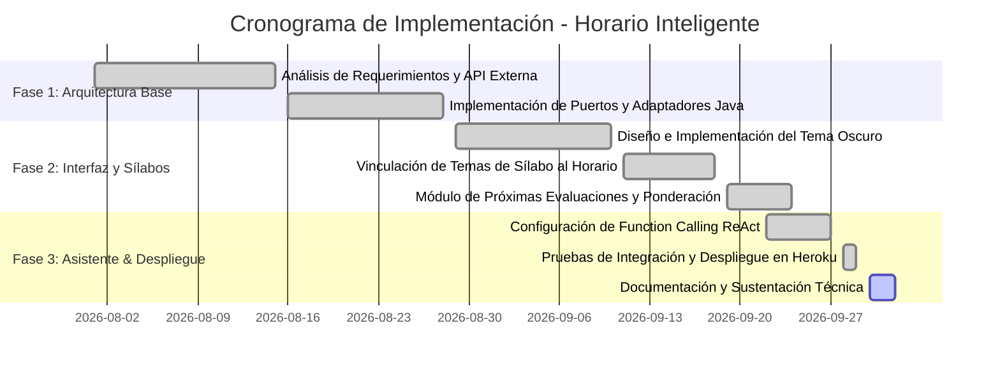
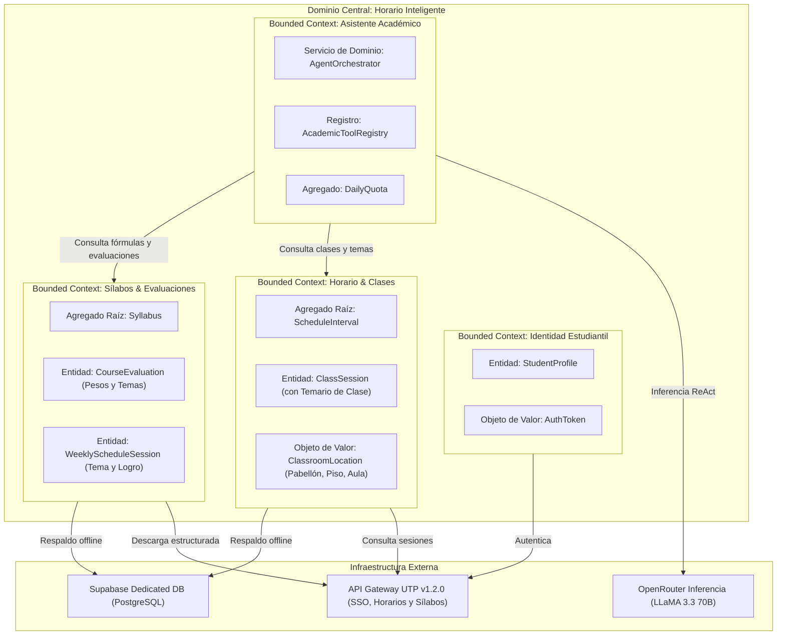
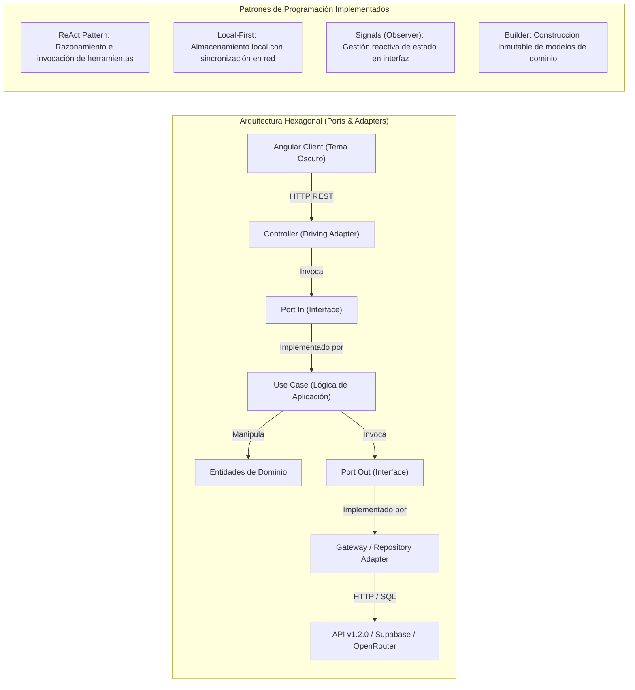
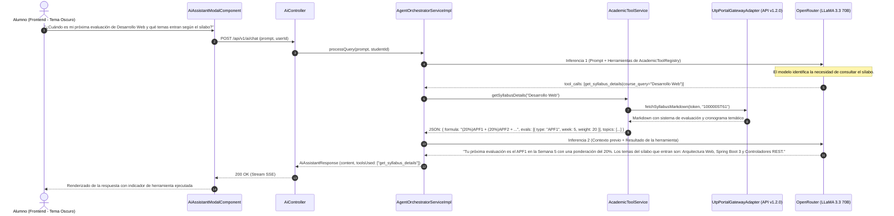
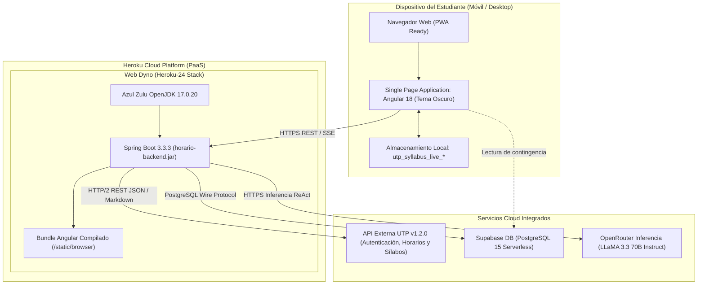
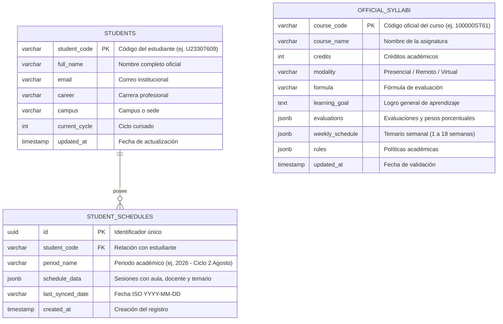

# Horario Inteligente: Sistema Web Académico con Integración de Sílabos Oficiales y Asistente Agéntico

> **Documento:** Especificación Técnica de Proyecto & Arquitectura de Software  
> **Versión:** 2.2.0 (Enfoque Técnico y Sobrio)  
> **Área:** Ingeniería de Software & Inteligencia Artificial Aplicada  
> **Target:** Presentación Técnica, Sustentación Académica y Documentación de Arquitectura

---

## 1. Introducción

### 1.1. Descripción Breve del Proyecto
**Horario Inteligente** es una aplicación web académica diseñada para resolver deficiencias operativas y funcionales identificadas en el uso diario de la plataforma universitaria oficial (UTP). El proyecto surge de un análisis funcional centrado en las necesidades del estudiante:

1. **Soporte de Tema Oscuro:** Provee una interfaz con fondo oscuro para mitigar la fatiga visual generada por interfaces predominantemente blancas durante jornadas de estudio nocturnas.
2. **Integración del Sílabo en el Horario:** Muestra directamente en cada bloque de clase el tema y la unidad curricular correspondiente, reconociendo que el sílabo es el documento rector bajo el cual planifica y avanza todo docente, evitando que el alumno deba localizar y abrir manualmente archivos PDF sesión tras sesión.
3. **Calendario Cronológico de Evaluaciones:** Presenta una línea temporal con las prácticas calificadas, avances de proyecto y exámenes, indicando sus ponderaciones porcentuales y los temas específicos del sílabo que abarcan.
4. **Asistente Académico con IA Agéntica:** Incorpora un modelo de lenguaje capaz de ejecutar herramientas (*Function Calling*) sobre datos institucionales verificados (aulas, horarios, docentes y temarios).

---

### 1.2. Objetivos del Proyecto

#### 1.2.1. Objetivo General
Desarrollar e implementar una aplicación web académica mediante Arquitectura Hexagonal en Spring Boot 3 y Angular 18 Standalone, orientada a integrar los temas del sílabo rector en las sesiones del horario, ofrecer una interfaz con tema oscuro y proveer un asistente agéntico para la consulta de información académica.

#### 1.2.2. Objetivos Específicos
1. **Ergonomía Visual:** Diseñar e implementar una interfaz nativa en tema oscuro (Dark Theme) que reduzca la fatiga ocular en ambientes con poca iluminación.
2. **Sincronización Curricular:** Asociar de manera automática las unidades y temas del sílabo oficial a las clases programadas del día y de la semana.
3. **Planificación de Evaluaciones:** Centralizar las prácticas calificadas (PC), avances de proyecto (APF) y exámenes finales en un cronograma que detalle ponderaciones y contenidos temáticos a evaluar.
4. **Asistencia Automatizada:** Integrar un asistente basado en LLM (LLaMA 3.3 70B vía OpenRouter) con capacidades de ejecución de herramientas (*Function Calling*) sobre endpoints institucionales, garantizando respuestas deterministas sin alucinaciones.
5. **Eficiencia y Desempeño:** Asegurar tiempos de respuesta inferiores a 50 ms en la carga de horarios mediante una arquitectura *Local-First* con persistencia local particionada por estudiante.

---

### 1.3. Importancia y Relevancia del Proyecto en el Contexto Actual
El análisis de uso cotidiano de la aplicación universitaria oficial evidenció cuatro limitaciones principales:

1. **Ausencia de Tema Oscuro:** La aplicación institucional dispone únicamente de una interfaz clara (fondo blanco), lo que incrementa el cansancio visual en estudiantes que revisan sus actividades durante la noche o en las primeras horas de la mañana.
2. **Desarticulación entre Horario y Sílabo:** El horario oficial muestra únicamente horas y aulas, pero omite el contenido temático de la sesión. Siendo el sílabo el documento rector que establece el avance del curso, el estudiante debe descargar y revisar de forma independiente archivos PDF extensos para conocer qué materia se impartirá en cada clase.
3. **Carencia de Asistencia Contextualizada:** A pesar del desarrollo actual de tecnologías basadas en modelos de lenguaje, la plataforma universitaria no ofrece mecanismos interactivos para responder consultas sobre aulas, profesores o temas de evaluación.
4. **Dispersión en la Información de Evaluaciones:** Las fechas y temas de las evaluaciones se encuentran fragmentados en diversos apartados, dificultando una planificación estructurada del estudio orientada a los temas del sílabo.

Horario Inteligente aborda estas cuatro necesidades mediante una arquitectura modular que conecta directamente la planificación horaria con los contenidos curriculares oficiales.

---

### 1.4. Lean Canvas

| Sección | Descripción |
| :--- | :--- |
| **1. Problema** | 1. Fatiga visual por ausencia de tema oscuro en la app oficial.<br>2. Horario sin contenido: omite los temas de clase estipulados en el sílabo rector.<br>3. Falta de un asistente inteligente para consultas académicas contextuales.<br>4. Ausencia de un calendario unificado de evaluaciones vinculado al temario oficial. |
| **2. Segmento de Clientes** | - Estudiantes universitarios de pregrado y posgrado (UTP y adaptable a otras instituciones).<br>- Alumnos con horarios nocturnos o actividades laborales complementarias.<br>- Delegados y grupos de estudio que requieren seguimiento del avance del sílabo. |
| **3. Propuesta de Valor** | *Plataforma académica con horario contextualizado por temas de sílabo, calendario de evaluaciones con ponderaciones oficiales, interfaz en tema oscuro y asistente agéntico para consultas estudiantiles.* |
| **4. Solución** | - Interfaz técnica en tema oscuro (base `#070709`) con contraste adecuado.<br>- Ficha de clase con visualización directa de unidad, tema y logro del día.<br>- Cronograma de evaluaciones con porcentajes y temas a estudiar según sílabo.<br>- Asistente agéntico con ejecución de herramientas sobre datos reales del alumno. |
| **5. Canales** | - Aplicación web responsiva (PWA) accesible desde cualquier navegador moderno.<br>- Enlaces directos institucionales y repositorios técnicos. |
| **6. Flujos de Ingresos** | - Modelo base institucional de acceso libre a horarios, sílabos y calendario.<br>- Opción de cuota ampliada de consultas para el asistente de IA y simulador de notas. |
| **7. Estructura de Costes** | - Costos de cómputo por inferencia de modelos en OpenRouter.<br>- Alojamiento de backend y frontend en plataforma cloud (Heroku Dyno).<br>- Base de datos relacional PostgreSQL en Supabase. |
| **8. Métricas Clave** | - Frecuencia de consulta del horario y temarios por estudiante activo.<br>- Tiempo promedio de recuperación de información curricular (< 50 ms).<br>- Precisión de ejecución de herramientas por el agente de IA (> 99%). |
| **9. Ventaja Diferencial** | Integración nativa entre el horario de clases y el sílabo rector normalizado, con soporte de *Function Calling* sobre datos institucionales. |

---

### 1.5. Equipo del Proyecto
* **Arquitectura de Software & Backend:** Diseño de arquitectura hexagonal, integración con API Gateway externa, gestión de persistencia y configuración del flujo ReAct con herramientas.
* **Desarrollo Frontend & Interfaz de Usuario:** Implementación de componentes Standalone en Angular 18, control de estado reactivo mediante Signals y aplicación del sistema de tema oscuro.
* **Control de Calidad & Datos:** Validación de esquemas en Supabase, pruebas de integración de endpoints y verificación de consistencia en el parseo de sílabos.

---

### 1.6. Cronograma del Proyecto



---

### 1.7. Metodologías Aplicadas
* **Domain-Driven Design (DDD):** Modelado enfocado en el dominio universitario (`StudentProfile`, `ClassSession`, `Syllabus`, `CourseEvaluation`).
* **Arquitectura Hexagonal (Ports & Adapters):** Separación rigurosa entre el núcleo de lógica de negocio y las dependencias tecnológicas externas.
* **Metodología Ágil Iterativa:** Ciclos de desarrollo enfocados en resolver problemas funcionales específicos detectados por los usuarios.

---

## 2. Antecedentes

### 2.1. Estado del Arte
Las plataformas de gestión universitaria tradicionales suelen concentrarse en módulos de registro académico y trámites administrativos. Con frecuencia, las aplicaciones móviles provistas a los estudiantes presentan dos desventajas técnicas:
* Interfaces con fondos claros fijos que no consideran las pautas de accesibilidad para visión en ambientes de baja iluminación.
* Arquitecturas orientadas a silos de información, donde el calendario de clases no se comunica directamente con los contenidos programáticos del sílabo.

La evolución reciente de la ingeniería de software ha estandarizado la adopción de temas oscuros nativos por razones de ergonomía visual y la implementación de asistentes agénticos capaces de consultar APIs mediante *Function Calling*, superando a los chatbots basados únicamente en respuestas estáticas preprogramadas.

---

### 2.2. Tecnologías o Proyectos Similares Existentes

| Criterio Técnico | App Oficial UTP | Canvas Student | Horario Inteligente (Proyecto) |
| :--- | :---: | :---: | :---: |
| **Soporte de Tema Oscuro** | No disponible (Fondo blanco fijo) | Parcial / Según configuración | **Nativo (Esquema de contraste oscuro #070709)** |
| **Temas del Sílabo en Horario** | No disponible | No disponible | **Integrado directamente en cada sesión de clase** |
| **Acceso a Fórmulas de Evaluación** | Requiere descarga de PDF | No disponible | **Desglosado en interfaz con ponderaciones** |
| **Calendario de Evaluaciones + Temario** | Solo fecha límite en tareas | Lista general de entregas | **Cronograma con ponderación (%) y temas a evaluar** |
| **Asistente Agéntico con Datos Reales** | No disponible | No disponible | **Implementado con ReAct y Function Calling** |

---

### 2.3. Justificación
* **Justificación de Ergonomía Visual:** La implementación del tema oscuro proporciona una experiencia de lectura cómoda para sesiones prolongadas de estudio, reduciendo el brillo excesivo en pantallas.
* **Justificación Curricular:** Al mostrar el tema de cada clase directamente en el horario, el estudiante conoce con anticipación los tópicos que el docente impartirá conforme al sílabo rector, optimizando la preparación previa.
* **Justificación de Planificación:** Centralizar las evaluaciones con sus temas asociados permite al alumno enfocar sus horas de estudio en los contenidos específicos estipulados institucionalmente.
* **Justificación Técnica:** La integración del asistente con *Function Calling* garantiza que toda respuesta sobre aulas, fechas o ponderaciones provenga de consultas directas a los datos oficiales del alumno.

---

### 2.4. Bases Teóricas
1. **Arquitectura Hexagonal (Cockburn, 2005):** Permite aislar la lógica del dominio estudiantil de los adaptadores de entrada (controladores REST) y de salida (APIs externas y base de datos).
2. **Patrón ReAct (Yao et al., 2022):** Estructura la interacción del modelo de lenguaje en ciclos de pensamiento (*Thought*), llamada a herramienta (*Action*) y procesamiento de resultado (*Observation*).
3. **Pautas de Accesibilidad Web (WCAG 2.1):** Cumplimiento de ratios de contraste adecuados entre texto y fondo para interfaces de baja luminosidad.

---

## 3. Descripción del Proyecto

### 3.1. Detalles Técnicos del Proyecto
* **Arquitectura:** Hexagonal en Backend (Spring Boot 3) y Clean Architecture modular con Signals (Angular 18).
* **Protocolos:** REST JSON bajo el sobre `ApiResponse<T>`, Server-Sent Events (SSE) para el asistente y Content Negotiation para Markdown (`text/markdown`).
* **Seguridad:** Tokens JWT Bearer, almacenamiento local cifrado de perfiles y aislamiento de datos por código de estudiante.

---

### 3.2. Funcionalidades Principales

#### 1. Tema Oscuro Integrado
Interfaz con esquema de color oscuro sobre una paleta en base `#070709`, con tarjetas en `#0e0e12` y acentos contrastados para clases presenciales, remotas y virtuales.

#### 2. Horario con Temas de Sílabo en Vivo
Cada bloque de la grilla semanal y de la vista del día (*Today View*) resuelve automáticamente la semana académica y extrae del sílabo oficial el tema y la unidad curricular correspondientes a dicha sesión.

#### 3. Calendario Cronológico de Evaluaciones
Línea temporal con las prácticas calificadas (PC), avances de proyecto (APF) y exámenes finales (EF), detallando:
* Semana de aplicación y peso porcentual en la fórmula de promedio.
* Modalidad de evaluación (Individual o Grupal).
* Temas específicos del sílabo que formarán parte de la prueba.

#### 4. Asistente Académico con Invocación de Herramientas
Módulo interactivo que permite consultas en lenguaje natural mediante herramientas específicas registradas en el backend:
* `get_today_schedule`: Consulta de pabellón, aula y docente del día.
* `get_enrolled_courses`: Lista oficial de asignaturas matriculadas.
* `get_syllabus_details`: Temarios, fórmulas y ponderaciones oficiales.
* `get_upcoming_evaluations`: Evaluaciones programadas en las semanas inmediatas.

#### 5. Visor Dinámico de Sílabos
Ficha curricular que adapta su longitud a ciclos regulares (18 semanas), ciclos de verano (8 a 9 semanas) o cursos modulares, permitiendo copiar la fórmula matemática de evaluación con un clic.

---

### 3.3. Tecnologías Utilizadas
* **Backend:** Java 17 LTS, Spring Boot 3.3.3, Jackson 2.17, Lombok, HttpClient nativo Java 11.
* **Frontend:** Angular 18 (Standalone Components, Signals, Computed properties), Tailwind CSS v3, TypeScript 5.5.
* **Bases de Datos & Cloud:** Supabase (PostgreSQL 15), Heroku PaaS (Stack Heroku-24 con Azul Zulu OpenJDK 17).
* **Inteligencia Artificial:** OpenRouter API Gateway, LLaMA 3.3 70B Instruct, Function Calling JSON Schema.

---

### 3.4. Diagramas y Esquemas

#### 3.4.1. Diagrama de Contexto y Dominio (DDD - Bounded Contexts)



---

#### 3.4.2. Diagrama de Clases (Arquitectura Hexagonal Backend)

```mermaid
classDiagram
    class ScheduleController {
        -ScheduleServicePort scheduleServicePort
        +getSchedule(studentId, authHeader, period) ResponseEntity
        +exportIcs(studentId, authHeader, period) ResponseEntity
    }

    class SyllabusController {
        -SyllabusServicePort syllabusServicePort
        +getSyllabus(courseCode, sectionId, pdfUrl) ResponseEntity
        +getSyllabusMarkdown(courseCode) ResponseEntity
    }

    class AiController {
        -AiAssistantServicePort aiServicePort
        +chat(query, studentId) ResponseEntity
        +chatStream(query, studentId) SseEmitter
    }

    class ScheduleServicePort {
        <<interface>>
        +getStudentSchedule(studentId, period, token) ScheduleInterval
    }

    class SyllabusServicePort {
        <<interface>>
        +getSyllabus(courseCode, sectionId, pdfUrl, token) Syllabus
        +saveSyllabus(syllabus) Syllabus
    }

    class AiAssistantServicePort {
        <<interface>>
        +processQuery(query, studentId, student, schedule, syllabi) AiAssistantResponse
    }

    class ScheduleServiceImpl {
        -UtpPortalGatewayPort gatewayPort
        -ScheduleRepositoryPort repoPort
        +getStudentSchedule(studentId, period, token) ScheduleInterval
    }

    class SyllabusServiceImpl {
        -UtpPortalGatewayPort gatewayPort
        -SyllabusRepositoryPort repoPort
        +getSyllabus(courseCode, sectionId, pdfUrl, token) Syllabus
    }

    class AgentOrchestratorServiceImpl {
        -AcademicToolService toolService
        -OpenRouterModelSelector modelSelector
        +processQuery(...) AiAssistantResponse
        -executeReActLoop(messages, studentId) String
    }

    class AcademicToolService {
        +getTodaySchedule(studentCode, date) DayScheduleResult
        +getEnrolledCourses(studentCode) EnrolledCoursesResult
        +getSyllabusDetails(courseQuery) SyllabusDetailsResult
        +getUpcomingEvaluations(studentCode, week) UpcomingEvaluationsResult
    }

    ScheduleController --> ScheduleServicePort
    SyllabusController --> SyllabusServicePort
    AiController --> AiAssistantServicePort

    ScheduleServiceImpl ..|> ScheduleServicePort
    SyllabusServiceImpl ..|> SyllabusServicePort
    AgentOrchestratorServiceImpl ..|> AiAssistantServicePort

    AgentOrchestratorServiceImpl --> AcademicToolService
```



---

#### 3.4.3. Diagrama de Paquetes

```mermaid
graph TD
    subgraph PresentationLayer["Capa de Presentación (Controladores REST & SSE)"]
        AuthController["AuthController"]
        SchedController["ScheduleController"]
        SylController["SyllabusController"]
        AiCtrl["AiController"]
    end

    subgraph ApplicationLayer["Capa de Aplicación (Puertos & Servicios)"]
        subgraph InPorts["Puertos de Entrada (In Ports)"]
            AuthIn["AuthenticateStudentUseCase"]
            SchedIn["ScheduleServicePort"]
            SylIn["SyllabusServicePort"]
            AiIn["AiAssistantServicePort"]
        end
        subgraph UseCases["Casos de Uso"]
            AuthService["AuthenticateStudentUseCaseImpl"]
            SchedService["ScheduleServiceImpl"]
            SylService["SyllabusServiceImpl"]
            Orchestrator["AgentOrchestratorServiceImpl"]
            ToolService["AcademicToolService"]
        end
    end

    subgraph DomainLayer["Capa de Dominio (Modelos del Negocio)"]
        Student["StudentProfile"]
        Interval["ScheduleInterval"]
        Session["ClassSession (Con Temario)"]
        SyllabusModel["Syllabus (Fórmulas y Cronograma)"]
        EvalModel["CourseEvaluation (Pesos %)"]
    end

    subgraph InfrastructureLayer["Capa de Infraestructura (Adaptadores)"]
        subgraph ExternalAdapters["Adaptadores de Pasarela"]
            UtpGateway["UtpPortalGatewayAdapter (API v1.2.0)"]
            OpenRouterAdp["OpenRouterGatewayAdapter (LLaMA 3.3)"]
        end
        subgraph PersistenceAdapters["Adaptadores de Persistencia"]
            SupabaseSched["SupabaseScheduleRepositoryAdapter"]
            SupabaseSyl["SupabaseSyllabusRepositoryAdapter"]
        end
    end

    PresentationLayer --> InPorts
    UseCases ..|> InPorts
    UseCases --> DomainLayer
    UseCases --> InfrastructureLayer
    InfrastructureLayer --> DomainLayer
```

---

#### 3.4.4. Diagrama de Patrones de Diseño Arquitectónico y de Programación



---

#### 3.4.5. Diagrama de Secuencia: Consulta sobre Evaluaciones y Temas de Sílabo



---

#### 3.4.6. Diagrama de Despliegue



---

#### 3.4.7. Diseño de Base de Datos (Entity-Relationship Diagram)



---

### 3.4.8. Diccionario de Datos

#### Tabla: `students`
Almacena el perfil del estudiante autenticado mediante el SSO institucional.
| Campo | Tipo | Nulo | Llave | Descripción |
| :--- | :--- | :---: | :---: | :--- |
| `student_code` | `VARCHAR(20)` | NO | **PK** | Código único de alumno (ej. `U23307609`). |
| `full_name` | `VARCHAR(150)` | NO | - | Nombre completo oficial registrado en la universidad. |
| `email` | `VARCHAR(100)` | NO | - | Correo institucional (`@utp.edu.pe`). |
| `career` | `VARCHAR(120)` | SÍ | - | Carrera profesional de matrícula. |
| `campus` | `VARCHAR(80)` | SÍ | - | Sede o campus asignado. |
| `current_cycle` | `INTEGER` | SÍ | - | Ciclo cursado actualmente (1 a 10). |
| `updated_at` | `TIMESTAMPTZ` | NO | - | Marca de tiempo de la última sincronización de perfil. |

#### Tabla: `official_syllabi`
Repositorio de sílabos rectores estructurados para asociar temas al horario y alimentar al asistente.
| Campo | Tipo | Nulo | Llave | Descripción |
| :--- | :--- | :---: | :---: | :--- |
| `course_code` | `VARCHAR(30)` | NO | **PK** | Código de curso (ej. `100000ST61`, `100000SI68`). |
| `course_name` | `VARCHAR(150)` | NO | - | Nombre oficial de la asignatura. |
| `credits` | `INTEGER` | NO | - | Créditos académicos. |
| `modality` | `VARCHAR(30)` | NO | - | Modalidad de enseñanza (`Presencial`, `Remoto Zoom`, `Virtual`). |
| `formula` | `VARCHAR(255)` | NO | - | Expresión matemática de evaluación (ej. `(20%)APF1 + (20%)APF2...`). |
| `learning_goal` | `TEXT` | SÍ | - | Logro general de aprendizaje. |
| `evaluations` | `JSONB` | NO | - | Arreglo JSON con código, descripción, semana y porcentaje. |
| `weekly_schedule` | `JSONB` | NO | - | Cronograma semanal con temas, unidades y actividades por sesión. |
| `rules` | `JSONB` | SÍ | - | Reglas de rezagados y nota mínima. |
| `updated_at` | `TIMESTAMPTZ` | NO | - | Fecha de validación por el Quality Gate. |

#### Tabla: `student_schedules`
Registros particionados del horario con temarios integrados para consulta de contingencia sin red.
| Campo | Tipo | Nulo | Llave | Descripción |
| :--- | :--- | :---: | :---: | :--- |
| `id` | `UUID` | NO | **PK** | Identificador UUID del horario sincronizado. |
| `student_code` | `VARCHAR(20)` | NO | **FK** | Referencia al código del estudiante. |
| `period_name` | `VARCHAR(50)` | NO | - | Periodo académico oficial (ej. `2026 - Ciclo 2 Agosto`). |
| `schedule_data` | `JSONB` | NO | - | Sesiones completas con aula, docente, horario y tema del sílabo. |
| `last_synced_date` | `VARCHAR(10)` | NO | - | Fecha ISO (`YYYY-MM-DD`). |
| `created_at` | `TIMESTAMPTZ` | NO | - | Timestamp de creación. |

---

### 3.4.9. Prototipos (Wireframes Estructurados en Tema Oscuro)

#### Vista 1: Today View (Horario con Temas de Sílabo en Vivo)
```text
+------------------------------------------------------------------------------------+
| [LOGO] HORARIO INTELIGENTE              [Hoy]  [Horario Semanal]  [Cursos]  (Copiloto IA) |
| Modo: [Tema Oscuro]                                              Usuario: u23307609|
+------------------------------------------------------------------------------------+
|  LUNES, 29 DE SEPTIEMBRE • SEMANA 8 (CICLO REGULAR)                                |
|                                                                                    |
|  +------------------------------------------------------------------------------+  |
|  | [CLASE EN CURSO]  Termina en 40 min                                          |  |
|  | DESARROLLO WEB INTEGRADO (Sección 34374)                   [ SALA ZOOM EN VIVO ]|  |
|  | Aula: A0402  |  Pabellón: A  |  Piso: 4  |  Docente: Ivan Robles Fernandez   |  |
|  |                                                                              |  |
|  | >> TEMA DE LA CLASE SEGÚN SÍLABO OFICIAL (Semana 8, Sesión 1):              |  |
|  |    "Arquitectura Hexagonal, Puertos y Adaptadores en Spring Boot 3"          |  |
|  |    Unidad 2: Desarrollo de Servicios RESTful de Alto Rendimiento             |  |
|  +------------------------------------------------------------------------------+  |
|                                                                                    |
|  CALENDARIO DE PRÓXIMAS EVALUACIONES (Temas según Sílabo Oficial):                 |
|  +------------------------------------------------------------------------------+  |
|  | [Semana 10] APF2: Avance Proyecto Final 2 - Ponderación: 20% - Faltan 14 días |  |
|  | Temas a evaluar: Microservicios, Docker Compose y Persistencia en Supabase    |  |
|  +------------------------------------------------------------------------------+  |
+------------------------------------------------------------------------------------+
```

#### Vista 2: Detalle de Asignatura y Cronograma Dinámico
```text
+------------------------------------------------------------------------------------+
| SÍLABO RECTOR: LENGUAJES DE PROGRAMACIÓN (100000SI68)                          [X] |
+------------------------------------------------------------------------------------+
| Créditos: 3   | Horas: 4 sem. | Modalidad: Presencial | Duración: 18 Semanas       |
|                                                                                    |
| FÓRMULA OFICIAL DE CALIFICACIÓN:                                                   |
| [ (25%)PC1 + (25%)PC2 + (10%)PA + (40%)PROY ]                   [ COPIAR FÓRMULA ] |
|                                                                                    |
| TEMARIO SEMANA A SEMANA:                                                           |
| • Semana 1: Paradigmas de programación y compiladores modernos                     |
| • Semana 4: Evaluación PC1 (25%) -> Temas: Semanas 1 a 3                           |
| • Semana 8: (Semana Actual) Concurrencia, Threads y Programación Asíncrona         |
| • Semana 12: Evaluación PC2 (25%) -> Temas: Concurrencia y Sockets                 |
| • Semana 18: Evaluación PROY (40%) -> Sustentación de Proyecto Final               |
+------------------------------------------------------------------------------------+
```

---

### 3.4.10. Especificación de Diseño Visual (Tema Oscuro Técnico)
La interfaz implementa un esquema sobrio con enfoque funcional:
* **Fondo Principal:** `#070709` (Negro neutro mate, optimizado para evitar reflejos y fatiga en pantallas).
* **Superficies y Paneles:** `#0e0e12` con bordes de delimitación en `rgba(255, 255, 255, 0.08)`.
* **Identificadores Visuales por Modalidad:**
  * **Verde Tenue (`#00e676` / `#bbf451`):** Sesiones presenciales y badges de estado activo.
  * **Amarillo Técnico (`#ffd600`):** Fórmulas de evaluación y porcentajes del sílabo.
  * **Azul (`#2979ff`):** Enlaces directos a sesiones Zoom.
* **Tipografía:** Familia tipográfica `Inter` para datos técnicos y tablas, asegurando legibilidad en tamaños reducidos (11 a 14 px).
* **Indicador de Procesamiento:** Componente gráfico interactivo (*Matrix Orb*) que refleja los estados de espera, inferencia y respuesta del asistente.

---

### 3.5. Landing Page

#### 3.5.1. Estructura de Contenidos de la Landing Page
1. **Sección Principal (Hero):**
   * Título: *"Horario Académico Inteligente con Integración Curricular"*
   * Subtítulo: *"Accede a tu horario en tema oscuro, consulta los temas del sílabo en cada clase, anticipa tus fechas de evaluación y utiliza un asistente con IA agéntica para resolver dudas académicas."*
   * Botón de Acción: `[ Iniciar Sesión con Credenciales Institucionales ]`
   * Indicadores: `[ Tema Oscuro • Consulta Inmediata (<50ms) • Vinculado a Sílabos Oficiales ]`
2. **Pilares de Solución:**
   * **Interfaz en Tema Oscuro:** Diseñada para lectura cómoda en sesiones nocturnas de estudio.
   * **Temas Curriculares en el Horario:** Cada sesión indica el tema de clase según el sílabo rector del docente.
   * **Cronograma de Evaluaciones:** Fechas, porcentajes de ponderación y contenidos específicos a evaluar.
   * **Asistente Académico Agéntico:** Consultas sobre aulas, profesores y temarios mediante *Function Calling*.
3. **Cuadro Comparativo Técnico:**
   * *App Oficial UTP:* Fondo blanco fijo, horario sin temas de clase, requiere búsqueda manual de PDFs, sin asistente de consulta.
   * *Horario Inteligente:* Tema oscuro, temas de clase visibles en cada sesión, cronograma de evaluaciones estructurado, asistente agéntico conectado a datos oficiales.
4. **Pie de Página:** Información sobre el estado de servicios en Heroku, política de protección de datos institucionales y enlace al repositorio de código fuente.
