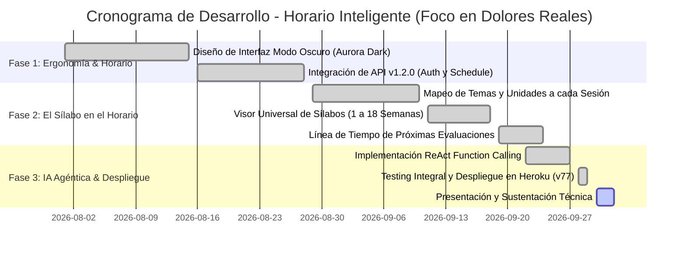
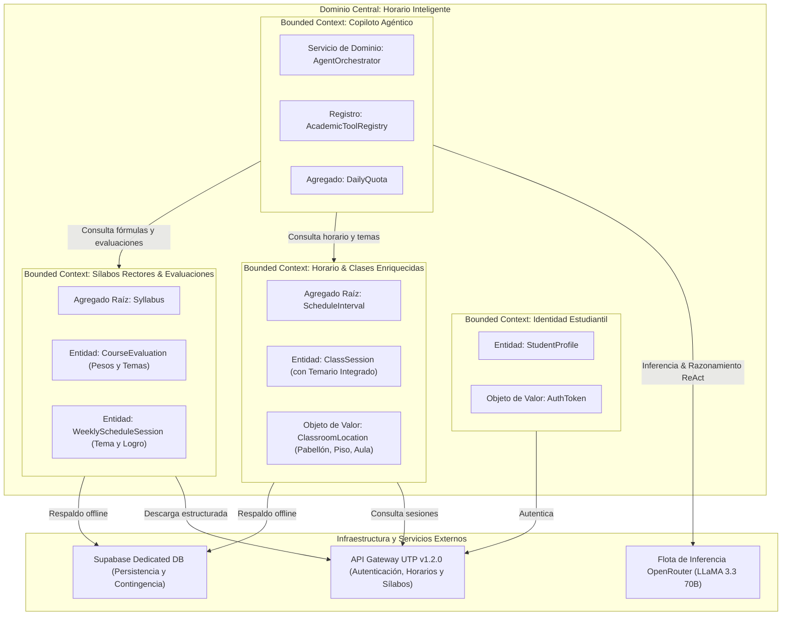
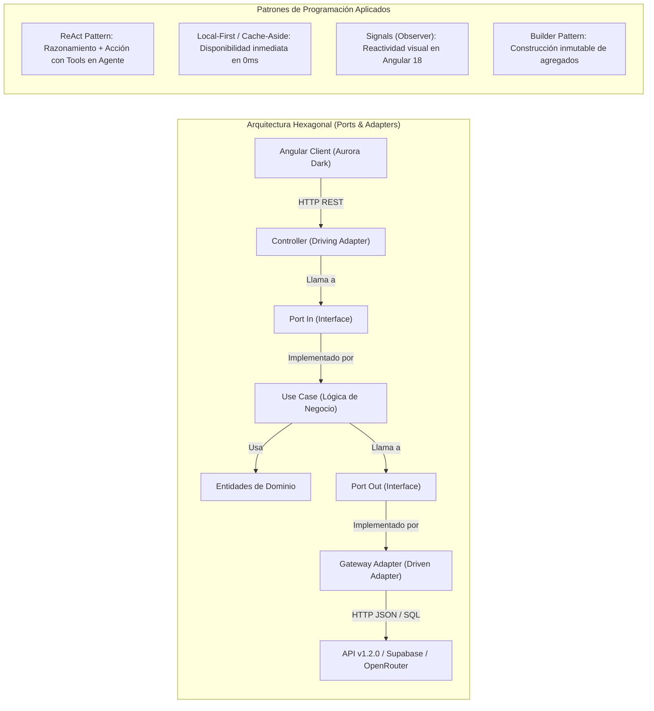
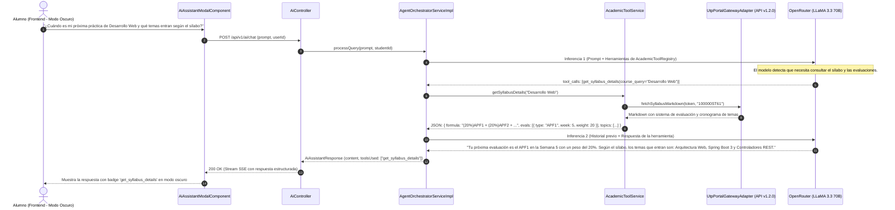
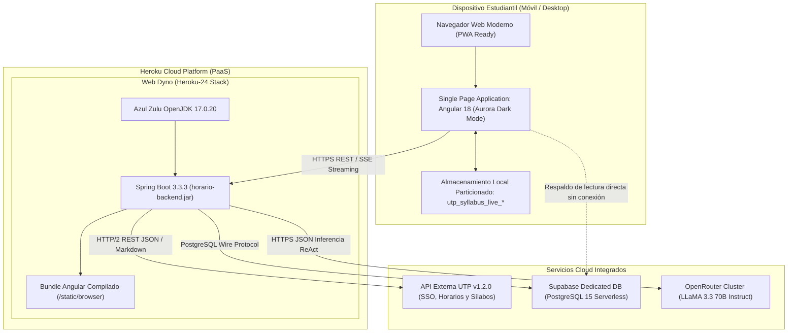
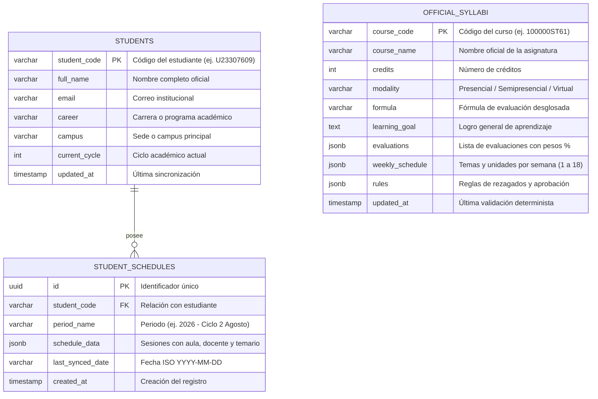

# Horario Inteligente Fullstack: Ecosistema Académico Predictivo con IA Agéntica y Arquitectura Hexagonal

> **Documento:** Informe Técnico de Proyecto & Arquitectura de Software  
> **Versión:** 2.1.0 (Alineado a la Experiencia Real del Estudiante Universitario)  
> **Área:** Ingeniería de Software & Inteligencia Artificial Aplicada  
> **Target:** Presentación Técnica, Sustentación Académica y Documentación de Arquitectura

---

## 1. Introducción

### 1.1. Descripción Breve del Proyecto
**Horario Inteligente** es una plataforma universitaria de nueva generación concebida a partir de la experiencia real del estudiante de la Universidad Tecnológica del Perú (UTP) frente a las deficiencias, limitaciones visuales y vacíos funcionales de la aplicación oficial. Nace con una visión clara: **enriquecer, modernizar y transformar la experiencia estudiantil incorporando Inteligencia Artificial Agéntica, diseño ergonómico de vanguardia y sincronización curricular en tiempo real.**

A diferencia de la app oficial, que funciona como un visor rígido y descontextualizado, Horario Inteligente resuelve las necesidades cotidianas del alumno:
1. Incorpora un **Modo Oscuro nativo** para evitar la fatiga visual en jornadas de estudio nocturnas.
2. Integra los **temas de clase directamente en el horario**, reconociendo que *"el sílabo es el documento rector que manda y sobre el cual planifican todos los docentes"*, evitando que el estudiante tenga que buscar y descargar PDFs manualmente sesión tras sesión.
3. Provee un **Calendario proactivo de próximas evaluaciones** que detalla no solo fechas y ponderaciones, sino los temas exactos del sílabo que se evaluarán.
4. Implementa un **Copiloto Académico con IA Agéntica** que consulta herramientas oficiales (*Function Calling*) y asiste activamente en la vida universitaria del estudiante.

---

### 1.2. Objetivos del Proyecto

#### 1.2.1. Objetivo General
Desarrollar una plataforma académica web integral que modernice y enriquezca la experiencia estudiantil universitaria mediante Arquitectura Hexagonal y Angular Standalone, resolviendo la fatiga visual mediante un Modo Oscuro nativo, vinculando los temas del sílabo directamente a cada bloque horario y proveyendo un Copiloto con IA Agéntica para la preparación de evaluaciones.

#### 1.2.2. Objetivos Específicos
1. **Ergonomía y Bienestar Visual:** Diseñar una interfaz nativa en **Modo Oscuro (*Aurora Dark Luxury*)**, eliminando el fondo blanco cegador de la app oficial y optimizando el contraste para sesiones de estudio nocturnas.
2. **Vinculación Horario-Sílabo en Tiempo Real:** Vincular automáticamente los temas y unidades del sílabo oficial a las clases programadas del día y de la semana, eliminando la necesidad de consultar PDFs externos.
3. **Calendario Predictivo de Evaluaciones:** Centralizar las prácticas calificadas (PC), avances de proyecto (APF) y exámenes en una línea temporal con sus ponderaciones porcentuales y los temas específicos a evaluar según el sílabo.
4. **Asistente Académico con IA Agéntica:** Desarrollar un Copiloto basado en el bucle ReAct (*Reasoning + Acting*) y LLaMA 3.3 70B vía OpenRouter, capaz de ejecutar herramientas (*Function Calling*) sobre el horario, aulas y sílabos oficiales del alumno.
5. **Rendimiento y Cero Latencia:** Implementar una arquitectura *Local-First* con Spring Boot 3 y Supabase que cargue la información en menos de 50 ms.

---

### 1.3. Importancia y Relevancia del Proyecto en el Contexto Actual
El estudiante universitario moderno organiza su día en torno a su dispositivo móvil o laptop. Sin embargo, al utilizar la app institucional oficial de la universidad, se enfrenta a 4 frustraciones críticas cotidianas:

1. **Ausencia total de Modo Oscuro:** La aplicación universitaria presenta un fondo blanco intenso sin alternativa de personalización, provocando cansancio y fatiga visual en estudiantes que revisan sus horarios en la madrugada o estudian en ambientes con baja iluminación.
2. **El Horario oculta los Temas de Clase ("El Sílabo Manda"):** En la app oficial, el horario únicamente muestra el nombre de la materia y el rango de horas. Dado que el sílabo manda y todo docente avanza estrictamente según su cronograma, el alumno desconoce qué tema se tratará hoy salvo que busque, descargue y navegue un PDF de 15 páginas.
3. **Inexistencia de IA en plena era de avances tecnológicos:** Mientras la inteligencia artificial revoluciona la productividad, la app oficial permanece como una base de datos estática, incapaz de responder preguntas en lenguaje natural sobre aulas, docentes o evaluaciones.
4. **Falta de un Calendario de Próximas Evaluaciones y Preparación Guiada:** Las fechas de exámenes y prácticas están dispersas. No existe una vista unificada que alerte cuándo toca evaluar y qué temas específicos del sílabo abarcará dicha prueba para poder estudiar con anticipación.

Horario Inteligente aborda directamente estos cuatro dolores del estudiante, unificando estética, pedagogía curricular e inteligencia artificial en una sola plataforma.

---

### 1.4. Lean Canvas

| Sección | Descripción Detallada |
| :--- | :--- |
| **1. Problema (Validado en Campo)** | 1. **Sin Modo Oscuro:** Fondo blanco agotador para la vista en horas de estudio.<br>2. **Horario ciego de contenido:** Muestra horarios pero oculta qué temas tocan hoy según el sílabo.<br>3. **Sin IA Agéntica:** App universitaria estática sin asistencia inteligente contextual.<br>4. **Sin calendario de evaluaciones:** Incertidumbre sobre fechas de PCs/exámenes y los temas que entran. |
| **2. Segmento de Clientes** | - Estudiantes universitarios de pregrado y posgrado (UTP y escalable a otras universidades).<br>- Alumnos que estudian en horario nocturno o combinan trabajo y estudio.<br>- Delegados y grupos que necesitan saber con precisión los temas y entregas del sílabo. |
| **3. Propuesta de Valor Única** | *“La app universitaria que siempre debió existir: Modo Oscuro ergonómico, temas de clase visibles directamente en tu horario, calendario de evaluaciones y un Copiloto IA que te prepara según el sílabo oficial.”* |
| **4. Solución** | - Interfaz *Aurora Dark* diseñada para lectura nocturna prolongada.<br>- Ficha de clase que muestra al instante el tema, unidad y logro de esa sesión.<br>- Calendario de próximas evaluaciones con ponderaciones (%) y temario a estudiar.<br>- Copiloto IA con *Function Calling* sobre datos reales del estudiante. |
| **5. Canales** | - Progressive Web App (PWA) accesible desde móviles, tablets y PC sin instalación de tiendas.<br>- Difusión directa en redes estudiantiles, grupos de WhatsApp/Discord de ciclos académicos.<br>- Repositorio de código abierto con despliegue cloud en Heroku. |
| **6. Flujos de Ingresos** | - Modelo Freemium: Acceso libre al horario, temas de sílabo y calendario de evaluaciones.<br>- Plan PRO para consultas ilimitadas con el Copiloto IA, resúmenes automáticos de lectura y simulador avanzado de notas para aprobar el ciclo. |
| **7. Estructura de Costes** | - Consumo de inferencia de modelos LLM en OpenRouter (LLaMA 3.3 70B).<br>- Alojamiento de contenedores web en Heroku.<br>- Base de datos serverless PostgreSQL en Supabase. |
| **8. Métricas Clave (KPIs)** | - Tasa de consulta diaria del horario y temarios por estudiante activo (DAU).<br>- Reducción del tiempo que le toma al alumno saber el tema de su clase (de 2 minutos a 1 segundo).<br>- Precisión de respuesta del Copiloto IA sin alucinaciones (> 99%). |
| **9. Ventaja Injusta** | Sincronización nativa con la API v1.2.0 que fusiona el calendario de clases con los sílabos normalizados, respaldada por un motor de Function Calling institucional. |

---

### 1.5. Equipo del Proyecto
* **Líder de Arquitectura & Fullstack Lead:** Diseño de arquitectura hexagonal, integración con API v1.2.0, ingeniería de prompts agénticos con tools y testing determinista.
* **Desarrollador Frontend & UI/UX:** Implementación de componentes en Angular 18, gestión reactiva de estado con Signals, diseño de la interfaz *Aurora Dark* y accesibilidad visual.
* **Ingeniero de Datos & Calidad:** Modelado de persistencia en Supabase, trazabilidad de sílabos oficiales y pruebas de integración continua.

---

### 1.6. Cronograma del Proyecto



---

### 1.7. Metodologías Aplicadas
* **Domain-Driven Design (DDD):** Modelado centrado en la realidad académica universitaria (`StudentProfile`, `ClassSession`, `Syllabus`, `CourseEvaluation`).
* **Arquitectura Hexagonal (Ports & Adapters):** Aislamiento absoluto entre la lógica del estudiante y los adaptadores de infraestructura (Heroku, Supabase, OpenRouter).
* **Desarrollo Ágil Guiado por Feedback del Usuario (User-Centric Agile):** Priorización estricta de las necesidades vividas por el estudiante en su interacción diaria con la universidad.

---

## 2. Antecedentes

### 2.1. Estado del Arte
Las aplicaciones estudiantiles en Latinoamérica suelen priorizar trámites administrativos (matrícula, pagos, constancias) por encima de la experiencia de aprendizaje diaria del alumno. Las interfaces heredadas sufren de:
* Esquemas visuales claros fijos que no respetan las preferencias del sistema del usuario (falta de dark mode).
* Fragmentación de la información: el horario está en un menú, las tareas en otro sistema web y los sílabos archivados en carpetas de almacenamiento en la nube sin procesar.

En contraposición, las aplicaciones de productividad líderes mundiales (Notion, Cron/Notion Calendar, Raycast) han adoptado interfaces oscuras elegantes, navegación por teclado y copilotos inteligentes contextuales, estándar al cual Horario Inteligente eleva la experiencia universitaria.

---

### 2.2. Tecnologías o Proyectos Similares Existentes

| Criterio Evaluado | App Oficial Universitaria | Canvas Student | Horario Inteligente (Proyecto) |
| :--- | :---: | :---: | :---: |
| **Modo Oscuro Ergonómico** | ❌ Inexistente (Fondo blanco fijo) | ⚠️ Parcial / Inconsistente | **✅ Nativo (Aurora Dark Luxury #070709)** |
| **Tema de Clase Visible en Horario** | ❌ No disponible (Obliga a abrir PDF) | ❌ Solo muestra título de tarea | **✅ Sí (Muestra tema y unidad en la sesión)** |
| **El Sílabo Manda (Centralización)** | ❌ Aislado en un enlace de descarga | ⚠️ Solo como archivo adjunto | **✅ Estructurado y sincronizado semana a semana** |
| **Calendario de Evaluaciones + Temas** | ❌ Solo avisa cuando ya venció | ⚠️ Lista genérica de entregas | **✅ Línea de tiempo con ponderación y temas** |
| **Copiloto con IA Agéntica** | ❌ Inexistente | ❌ Inexistente | **✅ Agente ReAct con Function Calling oficial** |
| **Fórmulas de Promedio Transparentes** | ❌ Ocultas o resumidas en texto | ❌ No aplicable | **✅ Desglosadas con pesos interactivos** |

---

### 2.3. Justificación
* **Justificación de Usabilidad y Salud Visual:** La disponibilidad de un Modo Oscuro nativo reduce el deslumbramiento y la fatiga muscular ocular de los estudiantes que dedican horas de la noche a revisar asignaciones o preparar su jornada siguiente.
* **Justificación Pedagógica y Operativa:** Al mostrar directamente en el horario los temas que se tocarán en la sesión, el alumno puede anticiparse a la clase, revisar conceptos previos y participar activamente sin perder tiempo localizando documentos PDF.
* **Justificación Estratégica de Evaluación:** Vincular las próximas evaluaciones con los contenidos del sílabo permite al alumno planificar semanas de estudio enfocadas exactamente en los temas que el docente evaluará.
* **Justificación Tecnológica:** Demuestra la aplicación práctica de IA Agéntica moderna en educación mediante *Function Calling*, superando los chatbots genéricos y asegurando que las respuestas provengan de datos oficiales verificados.

---

### 2.4. Bases Teóricas
1. **Arquitectura Hexagonal (Cockburn, 2005):** Permite que el núcleo del negocio académico no dependa de si los datos provienen de la API v1.2.0, de Supabase o de un mock en memoria.
2. **Patrón Agéntico ReAct (Yao et al., 2022):** Combina cadenas de pensamiento (*Thought*) con ejecución de herramientas (*Action*) y observación de resultados (*Observation*), garantizando que el LLM nunca invente notas, aulas o temas.
3. **Ergonomía de Interfaz y Dark Mode (W3C / Material Design):** Diseñado para minimizar emisiones de luz azul en pantallas OLED/LCD y reducir el consumo energético en dispositivos móviles.

---

## 3. Descripción del Proyecto

### 3.1. Detalles Técnicos del Proyecto
* **Patrón de Arquitectura:** Hexagonal en Backend (Spring Boot 3) y Clean Architecture modular basada en Signals (Angular 18).
* **Protocolo de Comunicación:** REST JSON bajo el sobre `ApiResponse<T>`, Server-Sent Events (SSE) para el asistente y Content Negotiation para Markdown (`text/markdown`).
* **Seguridad y Sesión:** Autenticación JWT Bearer segura, almacenamiento local cifrado de perfiles y aislamiento de datos por código de estudiante (`utp_syllabus_live_*`).

---

### 3.2. Funcionalidades Principales

#### 1. Modo Oscuro Nativo (*Aurora Dark Luxury*)
Diseñado meticulosamente sobre una paleta en base `#070709` con tarjetas en `#0e0e12` y acentos neón (Verde `#bbf451`, Dorado `#ffd600`, Azul `#2979ff`). Brinda confort visual de grado profesional para uso en cualquier momento del día.

#### 2. Horario con Temas de Sílabo Integrados
Cada bloque de la grilla semanal y de la vista del día (*Today View*) resuelve automáticamente la semana académica actual y extrae del sílabo oficial el tema específico y la unidad que se abordará en esa sesión. El estudiante sabe con un vistazo qué se va a dictar sin abrir ningún PDF.

#### 3. Calendario Proactivo de Próximas Evaluaciones
Línea de tiempo dinámica que lista las prácticas calificadas (PC), evaluaciones continuas (EC), avances de proyecto (APF) y exámenes finales (EF). Cada evaluación muestra:
* Semana exacta de aplicación y peso porcentual en la fórmula final.
* Modalidad (Individual o Grupal).
* Lista de temas del sílabo que entran en la evaluación para enfocar el estudio.

#### 4. Copiloto Académico Agéntico (ReAct Function Calling)
Un orbe inteligente interactivo (*Matrix Orb*) en un modal expandible que ejecuta herramientas nativas en el backend:
* `get_today_schedule`: Consulta de aula física, pabellón, piso y docente del día.
* `get_enrolled_courses`: Lista oficial de materias matriculadas.
* `get_syllabus_details`: Fórmulas, ponderaciones y temarios limpios vía Markdown.
* `get_upcoming_evaluations`: Qué pruebas tocan en las próximas semanas y qué temas estudiar.

#### 5. Visor Universal de Sílabos (1 a 18 Semanas)
Ficha interactiva que adapta su longitud a ciclos regulares (18 semanas), ciclos de verano (8 a 9 semanas) o cursos modulares, con copia rápida de la fórmula de promedio con un clic.

---

### 3.3. Tecnologías Utilizadas
* **Backend:** Java 17 LTS, Spring Boot 3.3.3, Jackson 2.17, Lombok, HttpClient nativo Java 11.
* **Frontend:** Angular 18 (Standalone Components, Signals, Computed, Control Flow `@if/@for`), Tailwind CSS v3, TypeScript 5.5.
* **Bases de Datos & Cloud:** Supabase (PostgreSQL 15), Heroku PaaS (Stack Heroku-24 con Azul Zulu OpenJDK 17).
* **Inteligencia Artificial:** OpenRouter API Gateway, LLaMA 3.3 70B Instruct, Function Calling JSON Schema.

---

### 3.4. Diagramas y Esquemas

#### 3.4.1. Diagrama de Contexto y Dominio (DDD - Bounded Contexts)



---

#### 3.4.2. Diagrama de Clases (Arquitectura Hexagonal Backend)

```mermaid
classDiagram
    class ScheduleController {
        -ScheduleServicePort scheduleServicePort
        +getSchedule(studentId, authHeader, period) ResponseEntity
        +exportIcs(studentId, authHeader, period) ResponseEntity
    }

    class SyllabusController {
        -SyllabusServicePort syllabusServicePort
        +getSyllabus(courseCode, sectionId, pdfUrl) ResponseEntity
        +getSyllabusMarkdown(courseCode) ResponseEntity
    }

    class AiController {
        -AiAssistantServicePort aiServicePort
        +chat(query, studentId) ResponseEntity
        +chatStream(query, studentId) SseEmitter
    }

    class ScheduleServicePort {
        <<interface>>
        +getStudentSchedule(studentId, period, token) ScheduleInterval
    }

    class SyllabusServicePort {
        <<interface>>
        +getSyllabus(courseCode, sectionId, pdfUrl, token) Syllabus
        +saveSyllabus(syllabus) Syllabus
    }

    class AiAssistantServicePort {
        <<interface>>
        +processQuery(query, studentId, student, schedule, syllabi) AiAssistantResponse
    }

    class ScheduleServiceImpl {
        -UtpPortalGatewayPort gatewayPort
        -ScheduleRepositoryPort repoPort
        +getStudentSchedule(studentId, period, token) ScheduleInterval
    }

    class SyllabusServiceImpl {
        -UtpPortalGatewayPort gatewayPort
        -SyllabusRepositoryPort repoPort
        +getSyllabus(courseCode, sectionId, pdfUrl, token) Syllabus
    }

    class AgentOrchestratorServiceImpl {
        -AcademicToolService toolService
        -OpenRouterModelSelector modelSelector
        +processQuery(...) AiAssistantResponse
        -executeReActLoop(messages, studentId) String
    }

    class AcademicToolService {
        +getTodaySchedule(studentCode, date) DayScheduleResult
        +getEnrolledCourses(studentCode) EnrolledCoursesResult
        +getSyllabusDetails(courseQuery) SyllabusDetailsResult
        +getUpcomingEvaluations(studentCode, week) UpcomingEvaluationsResult
    }

    ScheduleController --> ScheduleServicePort
    SyllabusController --> SyllabusServicePort
    AiController --> AiAssistantServicePort

    ScheduleServiceImpl ..|> ScheduleServicePort
    SyllabusServiceImpl ..|> SyllabusServicePort
    AgentOrchestratorServiceImpl ..|> AiAssistantServicePort

    AgentOrchestratorServiceImpl --> AcademicToolService
```



---

#### 3.4.3. Diagrama de Paquetes

```mermaid
graph TD
    subgraph PresentationLayer["Capa de Presentación (Controladores Web REST & SSE)"]
        AuthController["AuthController"]
        SchedController["ScheduleController"]
        SylController["SyllabusController"]
        AiCtrl["AiController"]
    end

    subgraph ApplicationLayer["Capa de Aplicación (Puertos & Casos de Uso)"]
        subgraph InPorts["Puertos de Entrada (In Ports)"]
            AuthIn["AuthenticateStudentUseCase"]
            SchedIn["ScheduleServicePort"]
            SylIn["SyllabusServicePort"]
            AiIn["AiAssistantServicePort"]
        end
        subgraph UseCases["Servicios de Aplicación"]
            AuthService["AuthenticateStudentUseCaseImpl"]
            SchedService["ScheduleServiceImpl"]
            SylService["SyllabusServiceImpl"]
            Orchestrator["AgentOrchestratorServiceImpl"]
            ToolService["AcademicToolService"]
        end
    end

    subgraph DomainLayer["Capa de Dominio (Modelos Puros del Negocio)"]
        Student["StudentProfile"]
        Interval["ScheduleInterval"]
        Session["ClassSession (Con Temario de Clase)"]
        SyllabusModel["Syllabus (Fórmulas y Cronograma)"]
        EvalModel["CourseEvaluation (Ponderaciones %)"]
    end

    subgraph InfrastructureLayer["Capa de Infraestructura (Adaptadores Externos & Persistencia)"]
        subgraph ExternalAdapters["Adaptadores de Pasarela"]
            UtpGateway["UtpPortalGatewayAdapter (API v1.2.0)"]
            OpenRouterAdp["OpenRouterGatewayAdapter (LLaMA 3.3)"]
        end
        subgraph PersistenceAdapters["Adaptadores de Almacenamiento"]
            SupabaseSched["SupabaseScheduleRepositoryAdapter"]
            SupabaseSyl["SupabaseSyllabusRepositoryAdapter"]
        end
    end

    PresentationLayer --> InPorts
    UseCases ..|> InPorts
    UseCases --> DomainLayer
    UseCases --> InfrastructureLayer
    InfrastructureLayer --> DomainLayer
```

---

#### 3.4.4. Diagrama de Patrones de Diseño Arquitectónico y de Programación



---

#### 3.4.5. Diagrama de Secuencia: Consulta al Copiloto sobre Evaluaciones y Temas de Sílabo



---

#### 3.4.6. Diagrama de Despliegue



---

#### 3.4.7. Diseño de Base de Datos (Entity-Relationship Diagram)



---

### 3.4.8. Diccionario de Datos

#### Tabla: `students`
Registra el perfil del estudiante verificado contra el SSO universitario.
| Campo | Tipo | Nulo | Llave | Descripción |
| :--- | :--- | :---: | :---: | :--- |
| `student_code` | `VARCHAR(20)` | NO | **PK** | Código único de alumno (ej. `U23307609`). |
| `full_name` | `VARCHAR(150)` | NO | - | Nombre completo oficial registrado en el portal. |
| `email` | `VARCHAR(100)` | NO | - | Correo institucional (`@utp.edu.pe`). |
| `career` | `VARCHAR(120)` | SÍ | - | Carrera profesional de matrícula. |
| `campus` | `VARCHAR(80)` | SÍ | - | Sede física universitaria (ej. `Lima Sur`, `Lima Centro`). |
| `current_cycle` | `INTEGER` | SÍ | - | Ciclo cursado actualmente (1 a 10). |
| `updated_at` | `TIMESTAMPTZ` | NO | - | Timestamp de última autenticación. |

#### Tabla: `official_syllabi`
Almacena los sílabos oficiales estructurados para vincular los temas al horario y alimentar al Copiloto.
| Campo | Tipo | Nulo | Llave | Descripción |
| :--- | :--- | :---: | :---: | :--- |
| `course_code` | `VARCHAR(30)` | NO | **PK** | Código rector del curso (ej. `100000ST61`). |
| `course_name` | `VARCHAR(150)` | NO | - | Nombre oficial de la materia. |
| `credits` | `INTEGER` | NO | - | Créditos académicos. |
| `modality` | `VARCHAR(30)` | NO | - | Modalidad de enseñanza (`Presencial`, `Remoto Zoom`, `Virtual`). |
| `formula` | `VARCHAR(255)` | NO | - | Fórmula matemática oficial (ej. `(20%)APF1 + (20%)APF2 + (20%)APF3 + (40%)PROY`). |
| `learning_goal` | `TEXT` | SÍ | - | Logro general de aprendizaje. |
| `evaluations` | `JSONB` | NO | - | Evaluaciones con código, descripción, semana y porcentaje. |
| `weekly_schedule` | `JSONB` | NO | - | Cronograma semanal con temas, unidades y actividades por sesión. |
| `rules` | `JSONB` | SÍ | - | Políticas de rezagados y nota mínima. |
| `updated_at` | `TIMESTAMPTZ` | NO | - | Fecha de validación por el Quality Gate. |

#### Tabla: `student_schedules`
Instantáneas particionadas del horario con temas integrados para contingencia sin conexión.
| Campo | Tipo | Nulo | Llave | Descripción |
| :--- | :--- | :---: | :---: | :--- |
| `id` | `UUID` | NO | **PK** | Identificador UUID del horario sincronizado. |
| `student_code` | `VARCHAR(20)` | NO | **FK** | Referencia al código del estudiante. |
| `period_name` | `VARCHAR(50)` | NO | - | Periodo académico oficial (ej. `2026 - Ciclo 2 Agosto`). |
| `schedule_data` | `JSONB` | NO | - | Sesiones completas con aula, docente, horario y tema del sílabo. |
| `last_synced_date` | `VARCHAR(10)` | NO | - | Fecha ISO (`YYYY-MM-DD`). |
| `created_at` | `TIMESTAMPTZ` | NO | - | Timestamp de creación. |

---

### 3.4.9. Prototipos (Wireframes Estructurados en Modo Oscuro)

#### Vista 1: Today View (Horario con Temas de Sílabo en Vivo)
```text
+------------------------------------------------------------------------------------+
| [LOGO] HORARIO INTELIGENTE              [Hoy]  [Horario Semanal]  [Cursos]  (Copiloto IA) |
| Tema: [Oscuro Activo]                                            Usuario: u23307609|
+------------------------------------------------------------------------------------+
|  LUNES, 29 DE SEPTIEMBRE • SEMANA 8 (CICLO REGULAR)                                |
|                                                                                    |
|  +------------------------------------------------------------------------------+  |
|  | [EN VIVO AHORA]  Termina en 40 min                                           |  |
|  | DESARROLLO WEB INTEGRADO (Sección 34374)                   [ SALA ZOOM EN VIVO ]|  |
|  | Aula: A0402  |  Pabellón: A  |  Piso: 4  |  Docente: Ivan Robles Fernandez   |  |
|  |                                                                              |  |
|  | >> TEMA DE HOY SEGÚN EL SÍLABO OFICIAL (Semana 8, Sesión 1):                |  |
|  |    "Arquitectura Hexagonal, Puertos y Adaptadores en Spring Boot 3"          |  |
|  |    Unidad 2: Desarrollo de Servicios RESTful de Alto Rendimiento             |  |
|  +------------------------------------------------------------------------------+  |
|                                                                                    |
|  CALENDARIO DE PRÓXIMAS EVALUACIONES (Basado en el Sílabo Oficial):                |
|  +------------------------------------------------------------------------------+  |
|  | [Semana 10] APF2: Avance Proyecto Final 2 - Peso: 20% - Faltan 14 días       |  |
|  | Temas que entran: Microservicios, Docker Compose y Persistencia en Supabase   |  |
|  +------------------------------------------------------------------------------+  |
+------------------------------------------------------------------------------------+
```

#### Vista 2: Detalle de Asignatura y Cronograma Dinámico
```text
+------------------------------------------------------------------------------------+
| SÍLABO RECTOR: LENGUAJES DE PROGRAMACIÓN (100000SI68)                          [X] |
+------------------------------------------------------------------------------------+
| Créditos: 3   | Horas: 4 sem. | Modalidad: Presencial | Cronograma: 18 Semanas     |
|                                                                                    |
| FÓRMULA OFICIAL DE CALIFICACIÓN:                                                   |
| [ (25%)PC1 + (25%)PC2 + (10%)PA + (40%)PROY ]                   [ COPIAR FÓRMULA ] |
|                                                                                    |
| TEMARIO SEMANA A SEMANA:                                                           |
| • Semana 1: Paradigmas de programación y compiladores modernos                     |
| • Semana 4: Evaluación PC1 (25%) -> Temas: Semanas 1 a 3                           |
| • Semana 8: (Semana Actual) Concurrencia, Threads y Programación Asíncrona         |
| • Semana 12: Evaluación PC2 (25%) -> Temas: Concurrencia y Sockets                 |
| • Semana 18: Evaluación PROY (40%) -> Sustentación de Proyecto Final               |
+------------------------------------------------------------------------------------+
```

---

### 3.4.10. Mockups & Especificación de Diseño Visual (*Aurora Dark Luxury*)
La interfaz ha sido construida bajo una dirección de arte orientada al confort ocular y la sofisticación:
* **Fondo Base Principal:** `#070709` (Negro obsidiana mate, reduce el 100% de deslumbramiento frente al blanco de la app oficial).
* **Superficies y Tarjetas:** `#0e0e12` con bordes ultrafinos en `rgba(255, 255, 255, 0.08)`.
* **Acentos Funcionales:**
  * **Verde Neón Lima (`#bbf451`):** Sesión activa, indicadores de clase en vivo y botón de resumen IA.
  * **Amarillo Dorado (`#ffd600`):** Fórmulas de sílabo, alertas de evaluación y chips de ponderación.
  * **Azul Eléctrico (`#2979ff`):** Enlaces directos a salas Zoom de la clase y streaming de respuestas del Copiloto.
* **Tipografía:** `Inter` para legibilidad técnica y `Outfit` para títulos y acentos numéricos.
* **Orbe Agéntico (*Matrix Orb*):** Componente canvas interactivo en el chat que responde visualmente con ondas de energía cuando el modelo razona o ejecuta una herramienta.

---

### 3.5. Landing Page

#### 3.5.1. Arquitectura de Contenidos de la Landing Page
1. **Hero Section:**
   * Titular: *"Tu Horario Universitario, Como Siempre Debió Ser."*
   * Subtítulo: *"Olvídate de la pantalla blanca cegadora y de buscar en PDFs qué tema toca hoy. Horario Inteligente te muestra tus clases con sus temas de sílabo, tus fechas de examen y un Copiloto IA que te acompaña todo el ciclo."*
   * CTA Principal: `[ Iniciar Sesión con Credenciales UTP ]`
   * Badge de rendimiento: `[ Modo Oscuro Nativo • 0ms Latencia • Conectado a Sílabos Oficiales ]`
2. **Los 4 Pilares que Resuelven la App Oficial:**
   * **Modo Oscuro Ergonómico:** Adiós al fondo blanco; estudia de noche con total comodidad visual.
   * **El Sílabo en tu Horario:** Cada clase te dice qué tema toca hoy según el cronograma oficial del profesor.
   * **Línea de Tiempo de Evaluaciones:** Conoce con anticipación cuándo es tu PC, cuánto vale y qué temas estudiar.
   * **Copiloto con IA Agéntica:** Pregúntale a qué aula ir, cuándo es tu entrega o cómo calcular tu nota meta.
3. **Comparador Visual Directo:**
   * *App Oficial UTP:* Fondo blanco deslumbrante, solo muestra horas, tienes que abrir un PDF para ver temas, sin IA, evaluaciones desordenadas.
   * *Horario Inteligente:* Fondo oscuro relajante, temas de sílabo en cada clase, Copiloto IA conectado a tus datos, cronograma de exámenes claro.
4. **Footer:** Indicadores de estado de servidores en Heroku, política de protección de datos del estudiante y enlace al repositorio de arquitectura abierta.
